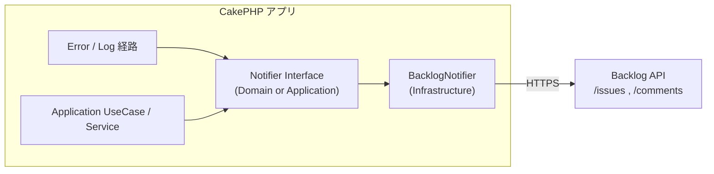

# Backlog エラー・イベント通知連携 概要設計書

| 項目 | 内容 |
|------|------|
| 文書ID | BN-OV-001 |
| 対象機能 | PHPアプリからBacklogへのエラー・イベント通知連携 |
| 対象システム | shokusuu1（食数管理システム / CakePHP） |
| 版 | 1.0 |
| 作成日 | 2026-07-25 |
| 課題キー | SHOKUSU-13 |
| 関連 GitHub Issue | [#578](https://github.com/kamaho-source/shokusuu1/issues/578) |

---

## 1. 文書の目的と関連文書

本ドキュメントは、アプリケーション実行時のエラーおよび指定ビジネスイベントを Backlog へ自動通知する機能の目的・スコープ・方針を定義する。

| 文書 | パス |
|------|------|
| 基本設計書 | [02-basic-design.md](./02-basic-design.md) |
| 詳細設計書 | [03-detailed-design.md](./03-detailed-design.md) |
| 要件元 | GitHub #578 / Backlog SHOKUSU-13 |
| 類似実装（先例） | `SlackLogEngine`（Issue #215 / PR #216） |

---

## 2. 背景と課題

現在、アプリのエラーやシステムイベントは主にログファイル（および任意の Slack エラー Webhook）に記録される。運用チームが日常利用する Backlog には自動連携がなく、障害・重要イベントの検知がログ監視や Slack に依存している。

Backlog への自動通知を追加することで、課題管理の文脈で障害・イベントを追跡し、対応速度を上げる。

---

## 3. 目的

1. 未処理例外・致命的エラーを Backlog に通知する  
2. テナント登録・ステータス変更など指定ビジネスイベントを Backlog に通知する  
3. 認証情報を環境変数で管理し、コードに埋め込まない  
4. 通知失敗がアプリ本体の業務処理をブロックしない  
5. 開発環境では通知を無効化できるようにする  
6. Clean Architecture の依存方向（外側→内側）に従う  

---

## 4. スコープ

### 4.1 In Scope

| # | 内容 |
|---|------|
| 1 | Backlog API クライアント（Infrastructure） |
| 2 | 通知用インターフェースと Application からの呼び出し |
| 3 | エラー系通知（Log 経路および／または ErrorHandler 連携） |
| 4 | ビジネスイベント通知（テナント登録・ステータス変更 等） |
| 5 | `BACKLOG_NOTIFY_ENABLED` 等による環境切替 |
| 6 | 通知失敗の握りつぶし（ログ記録は可） |
| 7 | 単体テスト（HTTP クライアント差し替え） |

### 4.2 Out of Scope（初版）

| # | 内容 | 備考 |
|---|------|------|
| 1 | Backlog 画面 UI の追加 | 通知先は既存課題／新規課題（設定） |
| 2 | ユーザー向けアプリ内画面 | なし |
| 3 | Excel / グラフ | 対象外 |
| 4 | 高度なレート制限ダッシュボード | 初版は簡易抑止（詳細設計で定義）を想定 |
| 5 | GitHub↔Backlog 同期 CI の改修 | 既存別機能。本機能は PHP ランタイム通知 |

---

## 5. 利用者と利用シーン

| 利用者 | 利用 |
|--------|------|
| 開発・運用担当 | Backlog でエラー／イベント通知を受信し対応 |
| システム管理者 | 環境変数で通知 ON/OFF・宛先課題を設定 |
| エンドユーザー | 直接操作なし（バックグラウンド） |

**シーン例**

- 本番で未捕捉例外が発生 → Backlog 課題にコメント追加  
- 新規テナント登録完了 → 運用用課題へイベント通知  
- テナントを suspended に変更 → 監査用に Backlog へ記録  

---

## 6. 全体構成（論理）

依存方向: Application/Domain は Interface のみ知る。Backlog HTTP 詳細は Infrastructure に閉じる。

---

## 7. 主要設計方針

| 方針 | 内容 |
|------|------|
| アーキテクチャ | Interface を内側、実装を `Infrastructure/Notification` に配置（Issue 案に準拠） |
| エラー通知 | 既存 `SlackLogEngine` と同様、失敗を業務に伝播させない。Cake `Log` チャネル（`BacklogLogEngine`）を**唯一のエラー通知入口**とする。未捕捉例外は ErrorHandler で Log に集約し、ErrorHandler から直接 Notifier を呼ばない |
| 重複抑止 | 同一例外／同一メッセージ指紋は **5 分** 以内に再送しない。窓経過後は再送可。イベント ID があればそれを優先キーとする |
| イベント通知 | 業務 UseCase / Service の成功後に Notifier を呼ぶ。失敗しても本体は成功のまま |
| 認証 | `.env` の API キー・スペース・プロジェクト。ハードコード禁止。クエリ `apiKey`。ログへキーを出さない |
| 切替 | `BACKLOG_NOTIFY_ENABLED=0` で完全スキップ（ローカル既定想定） |
| 通知形態 | 設定された「通知用課題」へのコメント追加を既定とし、イベント種別ごとに新規課題作成も選択可能（想定） |
| 既存 Slack | 置換しない。Slack と Backlog は併存可能 |

---

## 8. 画面構成（概要）

本機能にユーザー向け画面は設けない。設定は環境変数（および将来必要なら管理画面は別課題）。

---

## 9. 外部依存

| 依存 | 用途 |
|------|------|
| Backlog API v2 | 課題コメント追加、（任意）課題作成 |
| CakePHP `Http\Client` | HTTPS 呼び出し（`SlackLogEngine` と同様） |
| 環境変数 | API キー、スペース、プロジェクト、有効フラグ、通知先課題キー |

---

## 10. 非機能要件（概要）

| 区分 | 要件 |
|------|------|
| 可用性 | 通知失敗でも HTTP レスポンス・業務トランザクションを失敗させない |
| 性能 | 同期 HTTP の全体タイムアウト上限 **3 秒**（接続 2 秒・読取 3 秒）。これより長くブロックしない（将来キュー化は拡張） |
| セキュリティ | 秘密情報は env のみ。ログに API キーを出さない。レスポンス本文の過剰記録を避ける |
| 運用 | 開発では無効化。ステージング／本番で有効化手順を文書化 |
| 観測 | 通知失敗はアプリログにエラー記録（再帰通知に注意） |

---

## 11. リスクと対策

| リスク | 対策 |
|--------|------|
| 通知ループ（通知失敗 → Log::error → 再通知） | Backlog 用ログは専用 scope / フラグで再通知抑制 |
| Log と ErrorHandler の二重通知 | エラー通知入口を Log 経路のみに限定 |
| 障害時の大量コメント | 同一指紋 **5 分** 抑止。窓経過後は再送可 |
| API 障害で遅延 | 全体 timeout 3 秒 + try/catch。リトライなし。必要なら非同期化を将来課題に |
| クリーンアーキ乖離（Log Engine 直置きのみ） | 業務イベントは Interface 経由必須。エラーも Interface 越しを推奨 |
| 秘密情報漏洩 | env / Secrets。デバッグログに Authorization / apiKey を出さない |

---

## 12. 受け入れ条件（概要）

- [ ] エラー・指定イベント発生時に Backlog へ通知される  
- [ ] 同一例外を Log 経路から連続送信しても **5 分以内は 1 回**に抑えられる。別例外は別通知となる  
- [ ] 抑止窓経過後は同一指紋でも再送される  
- [ ] 認証情報が `.env` 管理である  
- [ ] 通知失敗がアプリ本体をブロックしない  
- [ ] 開発環境で通知無効化できる  
- [ ] Clean Architecture の依存方向に従う  
- [ ] 失敗ログに `BACKLOG_API_KEY` の生値が含まれない  

---

## 13. 改訂履歴

| 版 | 日付 | 内容 |
|----|------|------|
| 1.0 | 2026-07-25 | 初版（SHOKUSU-13 / #578・現行 Slack 先例に基づく。実装未着手のため一部は想定） |
| 1.1 | 2026-07-25 | エラー入口一本化・重複抑止・タイムアウト数値を明記 |
