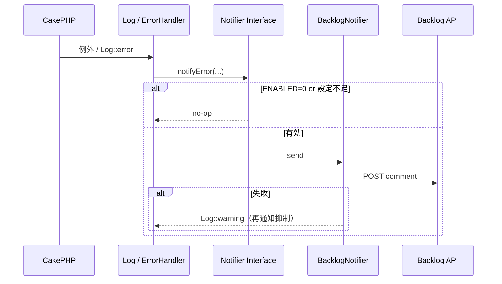
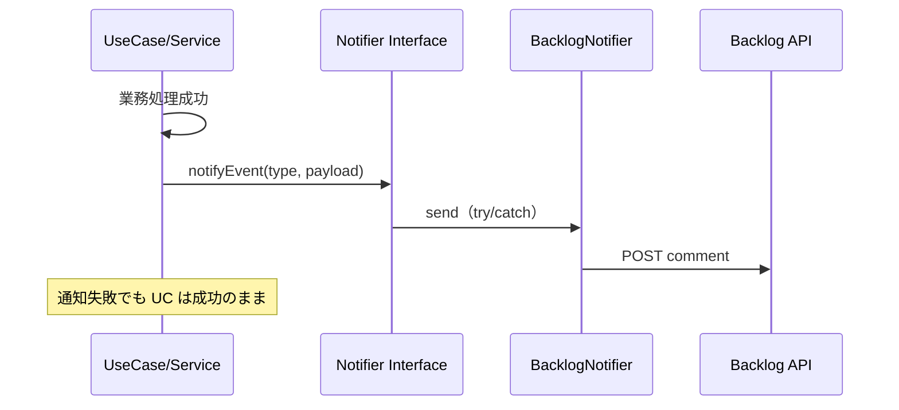

# Backlog エラー・イベント通知連携 基本設計書

| 項目 | 内容 |
|------|------|
| 文書ID | BN-BD-001 |
| 対象機能 | PHPアプリからBacklogへのエラー・イベント通知連携 |
| 版 | 1.0 |
| 作成日 | 2026-07-25 |
| 課題キー | SHOKUSU-13 |
| 上位文書 | [01-overview-design.md](./01-overview-design.md) |
| 下位文書 | [03-detailed-design.md](./03-detailed-design.md) |

---

## 1. 文書の目的

画面・API（外部 Backlog）・認可・データ・処理フローを定義し、実装・テストの基準とする。  
※本機能はエンドユーザー向け画面を持たない。

---

## 2. 機能一覧

| 機能ID | 機能名 | 概要 |
|--------|--------|------|
| F-01 | エラー通知 | 未処理例外／致命的エラー相当を Backlog へ通知 |
| F-02 | テナント登録通知 | セルフ登録・管理者追加完了時に通知 |
| F-03 | テナントステータス変更通知 | active / suspended 等の変更時に通知 |
| F-04 | 汎用イベント通知 | 他ビジネスイベントを同一 I/F で通知 |
| F-05 | 通知有効化制御 | env フラグでスキップ |
| F-06 | フェイルセーフ | 通知失敗を握りつぶし、本体処理継続 |

---

## 3. 画面設計

### 3.1 画面遷移

なし（バックグラウンド処理のみ）。

### 3.2 運用設定 UI

初版は画面なし。設定項目は環境変数（詳細設計の一覧参照）。

将来拡張（Out of Scope）: システム管理画面での通知先課題キー編集。

---

## 4. API 設計（外部: Backlog）

アプリが公開する REST API は追加しない。呼び出す外部 API は次のとおり。

| API ID | Method | Path | 用途 |
|--------|--------|------|------|
| A-01 | POST | `/api/v2/issues/{issueIdOrKey}/comments` | 既定の通知（コメント追加） |
| A-02 | POST | `/api/v2/issues` | （任意）イベントごとに新規課題作成 |

認証: クエリ `apiKey`（既存社内 Backlog 連携と同方式を想定）。

### 4.1 コメント本文（概要）

Markdown 想定。含める項目:

- 種別（error / tenant_registered / tenant_status_changed 等）
- 発生日時（JST 表記を推奨）
- メッセージ要約
- （エラー時）ファイル・行・スタック冒頭
- （イベント時）対象テナント ID・操作者・新旧ステータス等
- 環境名（production / staging 等）

### 4.2 アプリ側エラー

Backlog HTTP 失敗時は例外を上位業務へ再送出せず、アプリログに記録して終了（F-06）。

---

## 5. 認可設計

| 操作 | エンドユーザー | アプリサーバー |
|------|----------------|----------------|
| Backlog への通知送信 | 不可（直接操作なし） | API キーを持つプロセスのみ |
| 通知設定変更 | 不可（初版） | デプロイ／Secrets 更新 |

アプリ内 Policy 追加は不要（ユーザー操作 API なし）。  
API キーの権限は Backlog 上で課題コメント可能なユーザー／キーに限定する。

---

## 6. データ設計

### 6.1 DB 変更

初版: **テーブル追加なし**（想定）。通知は Backlog 側に永続化。

将来（任意）: 送信履歴テーブル、重複抑止キー。

### 6.2 環境変数（論理）

| 変数 | 意味 |
|------|------|
| `BACKLOG_NOTIFY_ENABLED` | `1` で有効。未設定/`0` はスキップ |
| `BACKLOG_DOMAIN` または `BACKLOG_SPACE_ID` | スペース特定 |
| `BACKLOG_API_KEY` | API キー |
| `BACKLOG_PROJECT_KEY` | 新規課題作成時のプロジェクト |
| `BACKLOG_NOTIFY_ISSUE_KEY` | コメント投稿先課題（例: `SHOKUSU-999`） |
| `BACKLOG_NOTIFY_TIMEOUT` | HTTP タイムアウト秒（想定） |
| `APP_ENV` / 既存 env | 環境名を本文に付与 |

既存の GitHub Actions 用 `BACKLOG_*` とキー名を揃え、アプリ `.env` / デプロイ Secrets に PHP 用を追加する。

### 6.3 セッション

使用しない。

---

## 7. 処理フロー

### 7.1 エラー通知

### 7.2 ビジネスイベント通知

### 7.3 Excel 出力

対象外。

### 7.4 集計ルール

対象外。通知ペイロードの整形ルールは詳細設計に記載。

---

## 8. コンポーネント配置

Issue 案およびクリーンアーキ方針に合わせた配置（実装時の正）:

| 層 | 配置 |
|----|------|
| Domain or Application | `BacklogNotifierInterface`（名称は実装時確定） |
| Application | イベント発生点からの呼び出し（Tenant 登録／ステータス変更 UseCase 等） |
| Infrastructure | `BacklogNotifier`（HTTP 実装） |
| Framework 接続 | `BacklogLogEngine`（想定）または ErrorHandler アダプタ → Interface 呼び出し |
| DI | `Application::services()` で Interface → 実装をバインド |

**現状実装との差分（想定）:** 先例 `SlackLogEngine` は `App\Log\Engine` に直置き。本機能は Issue 要件どおり Interface + Infrastructure を優先し、Log Engine はアダプタに留める。

---

## 9. エラーハンドリング方針

| 箇所 | 方針 |
|------|------|
| Backlog HTTP エラー | catch してアプリログ。業務例外に変換しない |
| 設定不備 | 無効扱い（no-op）。起動失敗にしない |
| 再帰防止 | Backlog 通知失敗ログは Backlog チャネルへ流さない |
| タイムアウト | 短時間で打ち切り |

---

## 10. テスト観点

| 観点 | 内容 |
|------|------|
| 無効フラグ | ENABLED=0 で HTTP が呼ばれない |
| 成功経路 | モック Client で comment API が呼ばれる |
| 失敗経路 | HTTP 例外でも呼び出し元が成功する |
| ペイロード | 種別・環境名・必須フィールドが含まれる |
| イベント | テナント登録／ステータス変更の呼び出し点で Interface がモック検証される |
| 秘密情報 | テスト・ログに API キーが含まれない |

---

## 11. 通知対象イベント（マッピング）

| イベント | トリガ想定箇所 | 機能ID |
|----------|----------------|--------|
| uncaught_error | Log error 以上 / ErrorHandler | F-01 |
| tenant_registered | テナント登録成功処理 | F-02 |
| tenant_status_changed | ステータス更新成功処理 | F-03 |
| （拡張）custom | 明示呼出し | F-04 |

具体クラス名は実装ブランチ確定後に詳細設計を更新する。

---

## 12. 改訂履歴

| 版 | 日付 | 内容 |
|----|------|------|
| 1.0 | 2026-07-25 | 初版（#578 要件・Slack 先例に基づく。実装前のためトリガ箇所は想定） |
