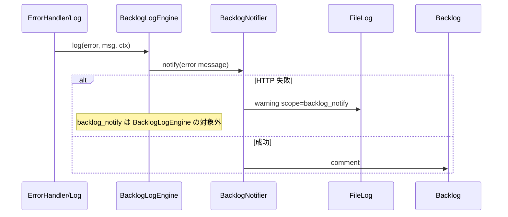

# Backlog エラー・イベント通知連携 詳細設計書

| 項目 | 内容 |
|------|------|
| 文書ID | BN-DD-001 |
| 対象機能 | PHPアプリからBacklogへのエラー・イベント通知連携 |
| 版 | 1.0 |
| 作成日 | 2026-07-25 |
| 課題キー | SHOKUSU-13 |
| 関連 Issue | GitHub [#578](https://github.com/kamaho-source/shokusuu1/issues/578) |
| 上位文書 | [02-basic-design.md](./02-basic-design.md) |
| 実装状態 | **未実装**（本設計は要件＋既存 Slack 先例に基づく実装仕様案） |

---

## 1. 文書の目的

クラス・メソッド・環境変数・シーケンス・エラーコードを実装可能な粒度で定義する。  
実装後にメソッド名等が確定したら本ドキュメントを実装優先で追従更新する。

---

## 2. ファイル構成（予定）

現行アプリは `src_web/kamaho-shokusu/src/` 配下。Issue の `src/Infrastructure/...` 表記は論理配置であり、実装パスは次を正とする。

| 種別 | パス（予定） |
|------|----------------|
| Interface | `src/Application/Notification/BacklogNotifierInterface.php` （または Domain） |
| DTO | `src/Application/Notification/BacklogNotifyMessage.php` |
| 実装 | `src/Infrastructure/Notification/BacklogNotifier.php` |
| Log アダプタ | `src/Log/Engine/BacklogLogEngine.php` |
| DI | `src/Application.php` `services()` |
| 設定 | `config/app.php`（Log チャネル登録） |
| env 例 | `.env.example` にキー追加 |
| テスト | `tests/TestCase/Infrastructure/Notification/BacklogNotifierTest.php` |
| テスト | `tests/TestCase/Log/Engine/BacklogLogEngineTest.php` |

**先例（実装済み・参照）:**

| パス | 役割 |
|------|------|
| `src/Log/Engine/SlackLogEngine.php` | エラー → Slack。失敗 swallow |
| `config/app.php` `slack_error` チャネル | levels: error\|critical\|alert\|emergency |
| `tests/TestCase/Log/Engine/SlackLogEngineTest.php` | Client モック注入 |

---

## 3. ルーティング詳細

アプリ公開ルートの追加なし。

外部:

```text
POST https://{space}.{domain}/api/v2/issues/{issueIdOrKey}/comments?apiKey=...
Content-Type: application/x-www-form-urlencoded
content={markdown}

POST https://{space}.{domain}/api/v2/issues?apiKey=...
projectId / summary / description / issueTypeId / ...
```

---

## 4. DI / 認可マップ

```text
BacklogNotifierInterface → BacklogNotifier
```

- コンテナ未解決時や ENABLED=0 時は Null 実装（`NullBacklogNotifier`）をバインドしてもよい（想定）。
- Authorization Policy 追加なし。

---

## 5. クラス詳細

### 5.1 `BacklogNotifierInterface`

```php
interface BacklogNotifierInterface
{
    public function notify(BacklogNotifyMessage $message): void;
}
```

- 戻り値 `void`。失敗は例外を外に出さない（実装内で捕捉）か、出しても呼び出し側で必ず catch（推奨は実装内捕捉）。

### 5.2 `BacklogNotifyMessage`（readonly 想定）

| プロパティ | 型 | 説明 |
|------------|----|------|
| `eventType` | string | `error` / `tenant_registered` / `tenant_status_changed` / … |
| `title` | string | 見出し |
| `body` | string | Markdown 本文 |
| `severity` | array | 構造化付加情報（ログ用・本文生成用） |
| `severity` | string\|null | 低\|中\|高（任意） |

### 5.3 `BacklogNotifier`（final）

| 定数 / 設定 | 内容 |
|-------------|------|
| 既定 timeout | 3 秒（想定） |
| base URL | `https://{BACKLOG_DOMAIN}/api/v2` または `https://{SPACE}.backlog.com/api/v2` |

| メソッド | 仕様 |
|----------|------|
| `__construct(Client $http, array $config = [])` | テストで Client 注入可（Slack と同じ） |
| `notify(BacklogNotifyMessage): void` | ENABLED 判定 → バリデーション → `postComment` |
| `isEnabled(): bool` | env 判定 |
| `postComment(string $issueKey, string $content): void` | A-01 |
| `createIssue(...): void` | A-02（任意・設定で切替） |
| `formatMarkdown(BacklogNotifyMessage): string` | 本文生成 |

例外処理:

```text
try {
  HTTP
} catch (\Throwable $e) {
  // 再通知禁止のログチャネルへ
  Log::write('warning', 'Backlog notify failed: '.$e->getMessage(), ['scope' => 'backlog_notify']);
}
```

### 5.4 `BacklogLogEngine`（final, extends BaseLog）

`SlackLogEngine` を踏襲。

| 項目 | 仕様 |
|------|------|
| 有効条件 | `BACKLOG_NOTIFY_ENABLED=1` かつ API キー・ISSUE_KEY あり |
| levels | `error`, `critical`, `alert`, `emergency` |
| 処理 | `BacklogNotifyMessage(eventType=error, ...)` を組み立て Interface へ。DI 困難なら Engine 内で Notifier を直接生成（暫定）し、将来 Container 取得に寄せる |
| HTTP 失敗 | catch 空 or warning（Slack 同様） |
| 再帰防止 | 本 Engine は `scopes` で `backlog_notify` を扱わない。失敗ログは File のみ |

### 5.5 Null 実装

`NullBacklogNotifier::notify()` は即 return。

---

## 6. メッセージ整形（エラー）

Slack 先例フィールド対応:

```text
[{LEVEL}] システムエラーが発生しました
メッセージ: ...
日時: Y-m-d H:i:s
環境: {APP_ENV}
ファイル: path (行: N)   # context にあれば
スタックトレース（冒頭）: 最大 N 行 / 500 文字
```

ビジネスイベント例（tenant_status_changed）:

```text
[EVENT] テナントステータス変更
tenant_id: ...
from: active → to: suspended
actor: ...
日時 / 環境
```

---

## 7. DB 詳細

マイグレーションなし（初版）。Entity 変更なし。

---

## 8. 呼び出し点（業務）詳細

| イベント | 挿入方針（想定） |
|----------|------------------|
| テナント登録成功 | 登録 UseCase / Service の永続化成功直後、`notify(tenant_registered)` |
| ステータス変更成功 | 更新成功直後、`notify(tenant_status_changed)` |
| その他 | 明示的に Interface をコンストラクタ注入して呼ぶ |

監査ログ（`AuditLogService`）との関係: DB 監査と Backlog 通知は独立。監査失敗と同様、通知失敗は業務成功を覆さない。

---

## 9. 画面 JS / メニュー

なし。

---

## 10. 環境変数詳細

| 変数 | 必須 | 既定 | 説明 |
|------|------|------|------|
| `BACKLOG_NOTIFY_ENABLED` | 実質必須 | `0` | `1` のみ送信 |
| `BACKLOG_API_KEY` | 有効時必須 | 空 | 秘密情報 |
| `BACKLOG_DOMAIN` | 推奨 | （空） | 例 `kamaho.backlog.com` |
| `BACKLOG_SPACE_ID` | 代替 | （空） | DOMAIN 未設定時 `{id}.backlog.com` |
| `BACKLOG_PROJECT_KEY` | 新規課題時 | `SHOKUSU` | |
| `BACKLOG_NOTIFY_ISSUE_KEY` | コメント方式時必須 | 空 | 例 `SHOKUSU-OPS` |
| `BACKLOG_NOTIFY_MODE` | 任意 | `comment` | `comment` \| `issue` |
| `BACKLOG_NOTIFY_TIMEOUT` | 任意 | `3` | 秒 |

デプロイ: staging/production のシークレットに追加。`SLACK_ERROR_WEBHOOK` とは独立。

---

## 11. エラーコード / ログ

| 状況 | アプリ挙動 | ログ |
|------|------------|------|
| DISABLED | no-op | なし（または debug） |
| 設定不足 | no-op | warning 1 回（起動時または初回）想定 |
| HTTP 4xx/5xx | swallow | `backlog_notify` scope warning |
| タイムアウト | swallow | 同上 |

ユーザー向け HTTP ステータス変更なし。

---

## 12. セッションキー

なし。

---

## 13. セキュリティチェックリスト

| # | 項目 | 対応 |
|---|------|------|
| 1 | API キーのハードコード禁止 | env のみ |
| 2 | ログへのキー出力禁止 | Client オプション・例外メッセージを精査 |
| 3 | 通知本文に個人情報を載せすぎない | パスワード・トークン禁止。必要最小の ID・名前 |
| 4 | 開発無効化 | ENABLED 既定 0 |
| 5 | 権限最小化 | コメント可能なキーのみ |
| 6 | SSRF | URL は固定 Backlog ドメインのみ組み立て |

---

## 14. シーケンス（エラー＋再帰防止）



---

## 15. 設定例（app.php Log）

```php
'backlog_error' => [
    'className' => BacklogLogEngine::class,
    'levels' => ['error', 'critical', 'alert', 'emergency'],
    'scopes' => null,
],
```

---

## 16. 将来拡張（対象外）

| 項目 | 内容 |
|------|------|
| 非同期キュー | Redis / Cake Queue で送信 |
| レート制限本格化 | 同一ハッシュ N 分に 1 回 |
| 管理画面 | 通知先課題・有効フラグの UI |
| 送信履歴テーブル | 監査・再送 |
| Slack 統合一本化 | 共通 Notifier ファサード |

---

## 17. 受け入れ条件との対応

| 受け入れ条件 | 設計上の実現 |
|--------------|--------------|
| エラー・イベントで Backlog 通知 | Log Engine + UseCase 呼出し |
| 認証情報は `.env` | §10 |
| 失敗で本体ブロックしない | try/catch・void I/F |
| 開発で無効化 | `BACKLOG_NOTIFY_ENABLED` |
| クリーンアーキ依存方向 | Interface 内側 / 実装 Infrastructure |

---

## 18. 改訂履歴

| 版 | 日付 | 内容 |
|----|------|------|
| 1.0 | 2026-07-25 | 初版（実装前仕様案。SlackLogEngine / #578 に準拠） |
