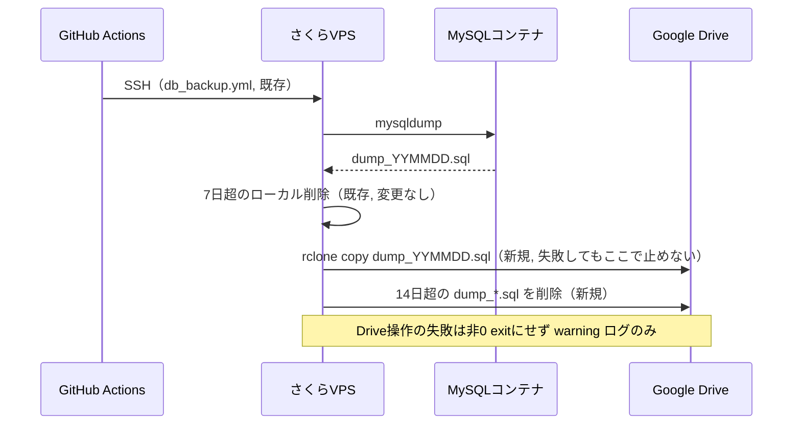

# [SHOKUSU-27] DBバックアップ Google Drive退避 — 詳細設計書（実装計画）

- 対象Issue: #652 / Backlog SHOKUSU-27
- 対象環境: 本番（さくらVPS）のみ。staging・自動リストアは対象外
- 前提調査日: 2026-08-20（Issue本文より）

---

## 1. 現状（As-Is）

```
GitHub Actions (db_backup.yml, JST 1:00 / main のみ)
  └─ SSH → VPS
       └─ scripts/db_backup.sh
            ├─ docker exec mysqldump → /tmp/dump.sql
            ├─ docker cp → ${BACKUP_DIR}/dump_YYMMDD.sql
            └─ find ${BACKUP_DIR} -mtime +7 -delete（7日超をローカル削除）
```

- `BACKUP_DIR` 既定値: `/home/ubuntu/backups/shokusu`
- 現存ファイル: `dump_260812.sql`〜`dump_260820.sql`（9本 / 約5.7MB）
- rclone / gdrive 系ツールは未導入
- `.github/workflows/audit-log-restore.yml` が `secrets.BACKUP_DIR` 配下の `dump_*.sql` を直接読む（**VPS側にファイルが残っている前提で動く。変更しない**）

## 2. 変更後（To-Be）



設計方針は3点:

1. **`scripts/db_backup.sh` 本体は触らない**。dump生成とローカル7日削除は現状のまま＝失敗境界を変えない。
2. Drive連携は新規スクリプト `scripts/db_backup_gdrive_sync.sh` に分離し、`db_backup.yml` から dump 成功後に呼ぶ。Drive側の失敗はこのスクリプト内で `set +e` 相当で握って exit 0 にし、mysqldump の成功結果を道連れにしない。
3. rclone の設定・認証は **VPSのローカル (`~/.config/rclone/rclone.conf`) にのみ存在**させ、リポジトリ・GitHub Secretsには置かない（Secretsに置くのは「使うリモート名」程度に留める）。

---

## 3. 実装タスク

### Task 1: VPS側の手動セットアップ（Issueのコード変更範囲外・事前作業）

- [ ] VPSに `rclone` をインストール（`curl https://rclone.org/install.sh | sudo bash`）
- [ ] Google Cloud Console でサービスアカウントを作成し、JSON鍵を発行（Drive APIを有効化）
- [ ] 共有ドライブ「shokusu-backups」（仮称）を作成し、上記サービスアカウントを「コンテンツ管理者」以上で共有ドライブのメンバーに追加
  - サービスアカウント単体は容量を持たないため、共有ドライブ経由でないとファイルを置けない点に注意
- [ ] JSON鍵をVPSの `/home/ubuntu/.config/rclone/gdrive-sa.json` 等（リポジトリ外）に配置し、パーミッションを絞る（`chmod 600`）
- [ ] `rclone config` でリモート `gdrive` を作成（`type=drive`, `service_account_file=<上記パス>`, `team_drive=<共有ドライブID>`）
- [ ] 疎通確認: `rclone mkdir gdrive:shokusu-backups && rclone lsd gdrive:`

### Task 2: 新規スクリプト `scripts/db_backup_gdrive_sync.sh`

```bash
#!/bin/bash
# Drive連携。失敗しても呼び出し元(db_backup.sh/ワークフロー)を失敗扱いにしない。
set +e

BACKUP_DIR="${BACKUP_DIR:-/home/ubuntu/backups/shokusu}"
RCLONE_REMOTE="${RCLONE_REMOTE:-gdrive:shokusu-backups}"
RETENTION_DAYS=14
DATE=$(date +%y%m%d)
TARGET_FILE="dump_${DATE}.sql"

if ! command -v rclone >/dev/null 2>&1; then
  echo "::warning::rclone が見つかりません。Drive同期をスキップします。"
  exit 0
fi

# 当日分をアップロード
if [ -f "${BACKUP_DIR}/${TARGET_FILE}" ]; then
  rclone copy "${BACKUP_DIR}/${TARGET_FILE}" "${RCLONE_REMOTE}/" --checksum
  if [ $? -ne 0 ]; then
    echo "::warning::Google Driveへのアップロードに失敗しました: ${TARGET_FILE}"
  else
    echo "Uploaded: ${TARGET_FILE} -> ${RCLONE_REMOTE}/"
  fi
else
  echo "::warning::アップロード対象が見つかりません: ${BACKUP_DIR}/${TARGET_FILE}"
fi

# Drive上で14日超のdump_*.sqlを削除（ファイル名の日付基準、mtimeは使わない）
CUTOFF=$(date -d "-${RETENTION_DAYS} days" +%y%m%d 2>/dev/null || date -v-${RETENTION_DAYS}d +%y%m%d)
rclone lsf "${RCLONE_REMOTE}/" --include "dump_*.sql" | while read -r f; do
  FILE_DATE=$(echo "$f" | sed -E 's/dump_([0-9]{6})\.sql/\1/')
  if [ -n "$FILE_DATE" ] && [ "$FILE_DATE" -lt "$CUTOFF" ]; then
    echo "Deleting old backup on Drive: $f (date=$FILE_DATE < cutoff=$CUTOFF)"
    rclone delete "${RCLONE_REMOTE}/${f}"
  fi
done

exit 0
```

ポイント:
- ファイル名の日付文字列で比較（`mtime` は使わない — 受け入れ条件どおり）
- `command -v rclone` が無い場合もジョブ全体を落とさない（未導入環境でも安全）
- 常に `exit 0`（このスクリプト自体の失敗が呼び出し元を失敗させない設計）

### Task 3: `.github/workflows/db_backup.yml` の変更

`script:` ブロックに1行追加するのみ（既存の `bash scripts/db_backup.sh` の後ろ）:

```diff
             cd ${{ secrets.DEPLOY_PATH }}
             DB_USER=${{ secrets.DB_USER }} \
             DB_PASS=${{ secrets.DB_PASS }} \
             BACKUP_DIR=${{ secrets.BACKUP_DIR || '/home/ubuntu/backups/shokusu' }} \
             bash scripts/db_backup.sh
+            BACKUP_DIR=${{ secrets.BACKUP_DIR || '/home/ubuntu/backups/shokusu' }} \
+            RCLONE_REMOTE=${{ secrets.GDRIVE_RCLONE_REMOTE || 'gdrive:shokusu-backups' }} \
+            bash scripts/db_backup_gdrive_sync.sh
```

`steps.backup.outcome` は appleboy/ssh-action の script 全体の結果を見ているため、`db_backup.sh` が成功しても `db_backup_gdrive_sync.sh` が非0 exitすれば同じ `backup` ステップが失敗扱いになる。そのためTask 2で **同期スクリプト自体は必ず `exit 0` を返す**設計にしている（内部の失敗は `::warning::` ログとして残すのみ）。

追加する GitHub Secrets:
| Secret名 | 内容 |
|---|---|
| `GDRIVE_RCLONE_REMOTE` | 例 `gdrive:shokusu-backups`（任意・既定値あり） |

rclone認証情報そのものはSecretsに置かない（VPS上の `rclone.conf` のみで完結）。

### Task 4: 初回移行（既存9本の退避）

コード変更ではなく手動オペレーション（Issueの受け入れ条件どおり「確認前にVPSから消さない」）:

```bash
# VPS上で1回だけ手動実行
rclone copy /home/ubuntu/backups/shokusu gdrive:shokusu-backups \
  --include "dump_*.sql" --checksum -v
rclone lsl gdrive:shokusu-backups   # 件数・サイズ確認
# 確認後、VPS側は既存の7日ルールに任せる（能動的に消さない）
```

### Task 5: ドキュメント化

- `docs/` 配下（本ファイルまたは運用手順書）に「監査ログ復元WFはVPS側の直近ファイルに依存し続ける。Drive削除の14日ルールとVPS側7日ルールは独立している」ことを明記する。
- README等の運用手順があれば、Drive宛先フォルダ名・rclone remote名を追記。

---

## 4. エラーハンドリング設計

| 失敗箇所 | 挙動 |
|---|---|
| mysqldump失敗（既存） | `db_backup.sh` が `set -e` で非0 exit → ジョブ失敗 → Slack失敗通知（既存どおり） |
| rclone未インストール | `db_backup_gdrive_sync.sh` が `::warning::` を出し `exit 0` → ジョブは成功扱い |
| rclone copy失敗（認証切れ等） | 同上。ジョブは成功扱いだが `::warning::` がActionsログに残る |
| rclone delete失敗 | 同上（ログのみ、対象ファイルは次回実行時に再度削除対象として評価される） |

→ 受け入れ条件「Drive連携が失敗してもバックアップ処理全体を失敗扱いにしない」を満たす。ただし**Drive失敗はSlackに通知されない**（成功通知は`db_backup.sh`のみを見ているため）。これは意図的な設計だが、Drive障害に気づけない期間ができるリスクがあるため運用上は Actions の実行ログを定期確認するか、`::warning::` を拾う追加のSlack通知ステップを別途検討する余地がある（本Issueスコープ外・フォローアップ候補）。

---

## 5. テスト計画

- [ ] VPS上で `db_backup_gdrive_sync.sh` を単体で手動実行し、当日分アップロード・14日超削除が動くことを確認
- [ ] `rclone` を一時的に `PATH` から外した状態で実行し、`::warning::` を出して `exit 0` になることを確認（フェイルセーフの検証）
- [ ] `db_backup.yml` を `workflow_dispatch` で手動起動し、Drive側に当日ファイルが増えることを確認
- [ ] 15日以上前の日付を持つダミーファイルをDrive上に作り、削除されることを確認
- [ ] Slack通知が従来どおり mysqldump の成否のみで送られることを確認（Drive失敗時に誤って失敗通知が飛ばないこと）

## 6. ロールバック方針

- `db_backup.yml` の追加行を1行削除すれば即座に旧挙動へ戻る（`db_backup.sh` 自体は無変更のため）
- Drive側のファイルは削除せず残置してよい（コスト影響は軽微）

---

## 7. 決定事項

1. **Drive宛先**: 共有ドライブ（決定）。サービスアカウントのみでも運用担当が通常のDrive画面から確認できる。
2. **認証方式**: サービスアカウント（決定）。ヘッドレスVPSでも初回対話認証が不要。
3. Backlog側キーの整理: 旧 #651（SHOKUSU-27）は本Issue(#652)へ作り直し済み・close済み。タイトルは今回 `[SHOKUSU-27]` に統一済み。

上記2点は2026-08-25にユーザー確認済み。Task1（下記）で反映する。

---

## 8. 見積もり

| タスク | 見積 |
|---|---|
| Task1 VPSセットアップ（rclone導入・認証） | 0.5日（宛先/認証方式が決まっていれば） |
| Task2-3 スクリプト・ワークフロー実装 | 0.5日 |
| Task4 初回移行 | 0.5時間 |
| Task5 ドキュメント | 0.5時間 |
| テスト・動作確認 | 0.5日 |
| **合計** | **約1.5〜2日**（未解決事項の決定待ちを除く） |
