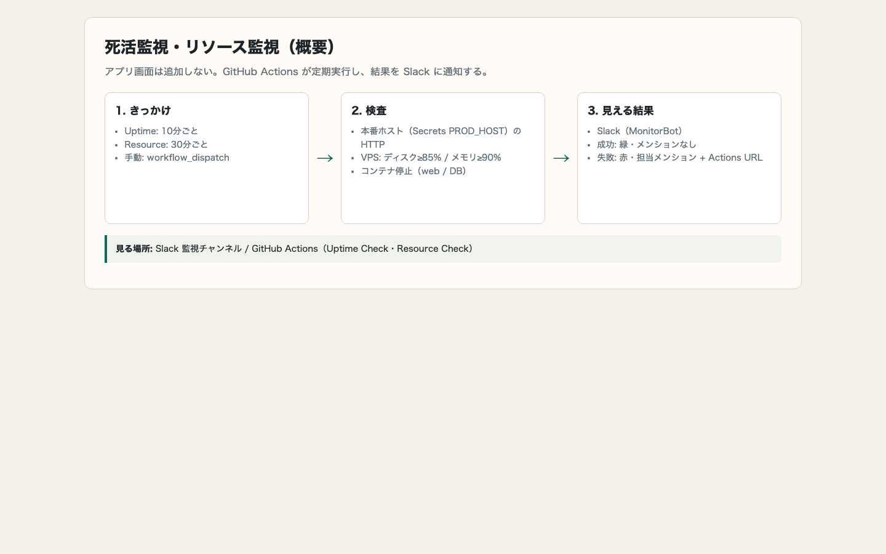
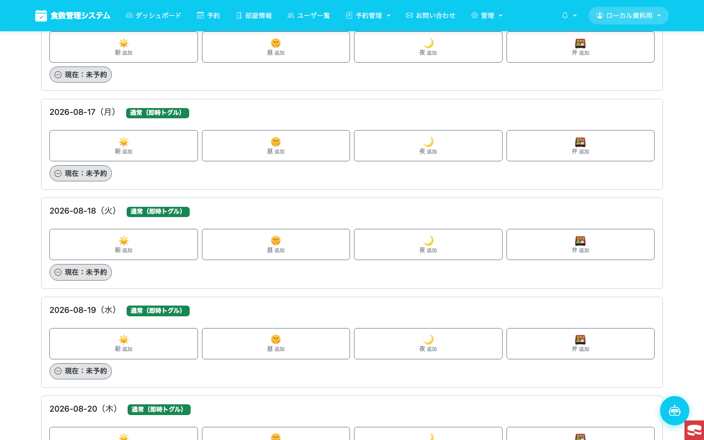
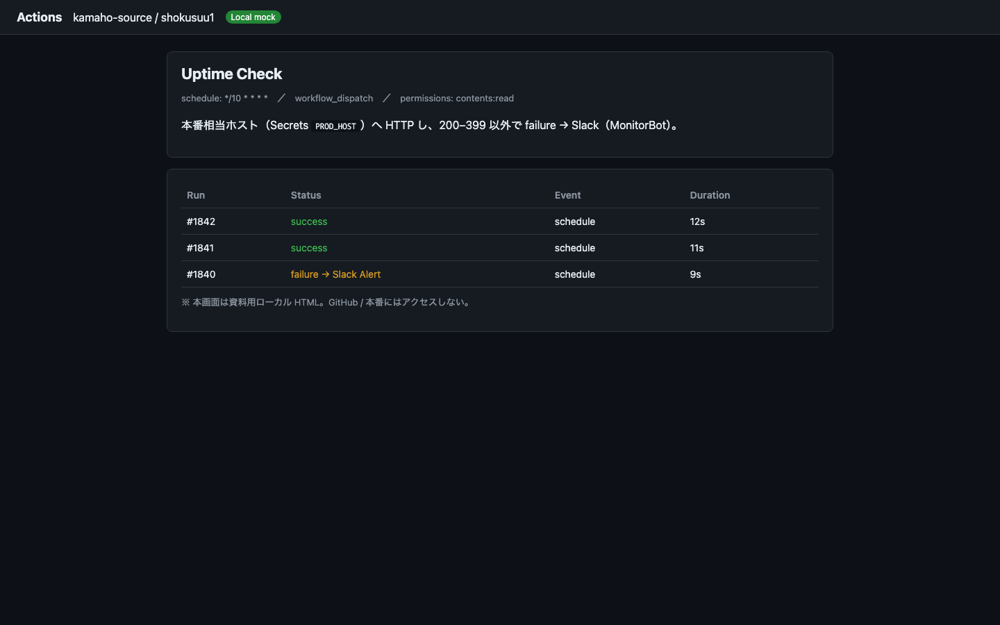
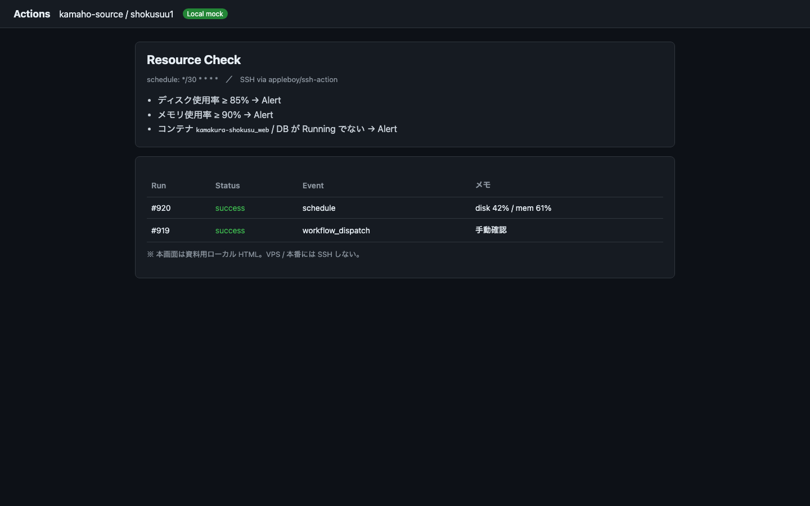
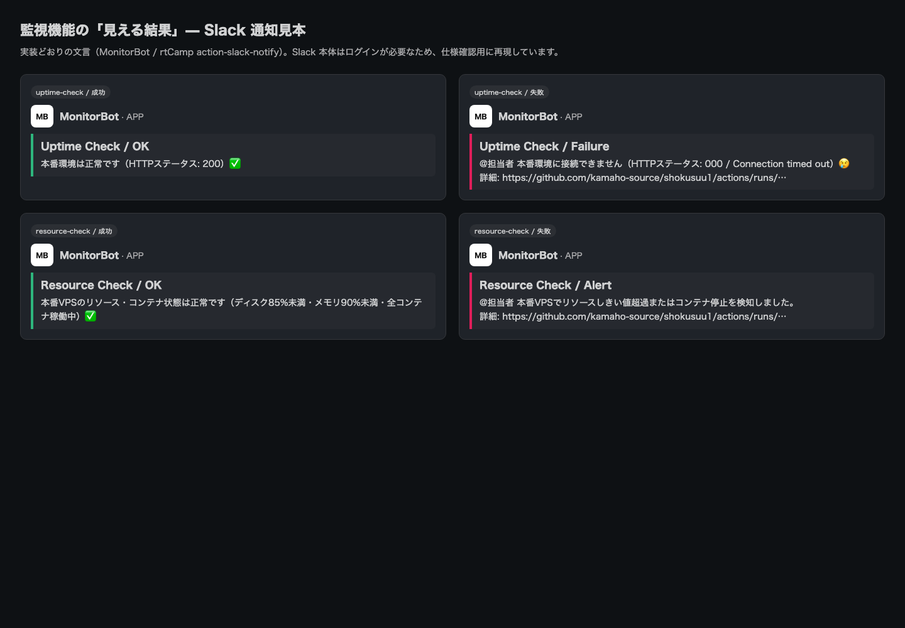

# 概要設計書（PowerPoint 原稿）— 死活監視・リソース監視

| 項目 | 内容 |
|------|------|
| 文書種別 | 概要設計書（スライド化用 Markdown） |
| 対象 | 死活監視・VPS リソース監視＋Slack 通知（main 稼働） |
| 実装状態 | **main で稼働中** |
| 導入 | PR [#620](https://github.com/kamaho-source/shokusuu1/pull/620)（以降 #623/#624/#627） |
| 実装 | `.github/workflows/uptime-check.yml` / `resource-check.yml` |
| スクショ方針 | **本番・GitHub にはアクセスしない。ローカル Docker ＋ローカル HTML モックのみ** |
| ローカルアカウント | `local_docs` / `LocalDocs#2026`（資料用・Docker DB に作成済み） |
| ローカル入口 | `/Users/oohashikazuyuki/shokusuu1/docs/monitoring-slack/01-overview-design-ppt.md` |

> 各 `## スライド` が PowerPoint 1 枚分。画像は相対パスで埋め込み、絶対パスも併記。

---

## スライド 1 — 表紙

**タイトル:** 死活監視・リソース監視 概要設計書  
**サブ:** shokusuu1 / GitHub Actions × Slack  
**注:** アプリ設定画面は追加しない（運用向け自動監視）  
**資料スクショ:** ローカル環境のみ（本番 URL 不使用）

---

## スライド 2 — 一言で言うと

本番ホストが生きているか、VPS のディスク／メモリ／コンテナが健全かを  
**GitHub Actions が定期チェックし、結果を Slack に通知する。**

| 見る場所 | 内容 |
|----------|------|
| Slack（MonitorBot） | 成功＝緑 / 失敗＝赤＋メンション |
| GitHub Actions | 実行履歴・詳細ログへのリンク |

---

## スライド 3 — 全体の流れ



絶対パス: `/Users/oohashikazuyuki/shokusuu1/docs/monitoring-slack/screenshots/08-overview-flow.png`

1. **きっかけ** … cron（10分 / 30分）または手動  
2. **検査** … HTTP または SSH でしきい値判定  
3. **結果** … Slack 通知（成功／失敗）

---

## スライド 4 — 監視対象アプリの見た目（ローカル検証）

本番へはアクセスせず、ローカル Docker（`localhost:8091`）に資料用アカウントでログインした画面を掲載する。  
（実監視 URL は Secrets `PROD_HOST`。コードは main の workflow を参照）


絶対パス: `/Users/oohashikazuyuki/shokusuu1/docs/monitoring-slack/screenshots/01-local-login.png`



絶対パス: `/Users/oohashikazuyuki/shokusuu1/docs/monitoring-slack/screenshots/01-prod-monitored-site.png`

- 判定（本番稼働時）: HTTP ステータスが 200–399 なら成功（ログイン可否は見ない）
- 資料用アカウント: `local_docs`（管理者・部屋1所属）

---

## スライド 5 — 機能一覧

| ID | 機能 | 間隔 | 手段 |
|----|------|------|------|
| F-01 | 死活監視（Uptime Check） | 10分 | `curl` → Secrets の本番ホスト |
| F-02 | リソース監視（Resource Check） | 30分 | SSH → ディスク／メモリ／Docker |
| F-03 | Slack 成功通知 | 各実行 | MonitorBot・緑・メンションなし |
| F-04 | Slack 失敗通知 | 失敗時 | MonitorBot・赤・担当メンション＋Actions URL |

---

## スライド 6 — 死活監視（コード要約）

```yaml
# .github/workflows/uptime-check.yml（要点）
on:
  schedule: [{ cron: "*/10 * * * *" }]
  workflow_dispatch:

# 検査
HOST="${{ secrets.PROD_HOST }}"
URL="https://${HOST}/"
STATUS=$(curl -s -o /dev/null -w "%{http_code}" --max-time 10 "$URL")
# 200–399 以外 → failure

# 通知（rtCamp/action-slack-notify@v2）
# success → "Uptime Check / OK"
# failure → "Uptime Check / Failure" + <@MENTION> + run URL
```

実ファイル（ローカル）:  
`/Users/oohashikazuyuki/shokusuu1/.github/workflows/uptime-check.yml`

---

## スライド 7 — 死活監視の画面イメージ（ローカルモック）



絶対パス: `/Users/oohashikazuyuki/shokusuu1/docs/monitoring-slack/screenshots/02-gha-uptime-workflow.png`


絶対パス: `/Users/oohashikazuyuki/shokusuu1/docs/monitoring-slack/screenshots/06-gha-uptime-run.png`

> GitHub 本番 UI ではなく、仕様説明用のローカル HTML モック。

---

## スライド 8 — リソース監視（コード要約）

```yaml
# .github/workflows/resource-check.yml（要点）
on:
  schedule: [{ cron: "*/30 * * * *" }]
  workflow_dispatch:

# SSH 先: secrets.VPS_HOST / PROD_USER / PROD_SSH_PASSWORD
DISK_THRESHOLD=85
MEM_THRESHOLD=90
# df / free で使用率取得
# コンテナ: kamakura-shokusu_web と secrets.DB_CONTAINER が Running であること
# いずれか超過・停止 → failure → Slack Alert
```

実ファイル（ローカル）:  
`/Users/oohashikazuyuki/shokusuu1/.github/workflows/resource-check.yml`

---

## スライド 9 — リソース監視の画面イメージ（ローカルモック）


絶対パス: `/Users/oohashikazuyuki/shokusuu1/docs/monitoring-slack/screenshots/03-gha-resource-workflow.png`



絶対パス: `/Users/oohashikazuyuki/shokusuu1/docs/monitoring-slack/screenshots/07-gha-resource-run.png`

---

## スライド 10 — Slack にこう見える（仕様の核）



絶対パス: `/Users/oohashikazuyuki/shokusuu1/docs/monitoring-slack/screenshots/09-slack-notify-samples.png`

| ケース | タイトル例 | ポイント |
|--------|------------|----------|
| Uptime 成功 | Uptime Check / OK | メンションなし |
| Uptime 失敗 | Uptime Check / Failure | メンション＋HTTP／エラー詳細＋run URL |
| Resource 成功 | Resource Check / OK | しきい値の説明付き |
| Resource 失敗 | Resource Check / Alert | メンション＋run URL |

---

## スライド 11 — 設定（Secrets）

| Secret | 用途 |
|--------|------|
| `SLACK_MONITORING_WEBHOOK` | 監視専用 Incoming Webhook |
| `SLACK_MENTION_USER_ID` | 失敗時メンション |
| `PROD_HOST` | Uptime Check のホスト名 |
| `VPS_HOST` | Resource Check の SSH 先 |
| `PROD_USER` / `PROD_SSH_PASSWORD` | SSH 認証 |
| `DB_CONTAINER` | 監視する DB コンテナ名 |

アプリの `.env` 画面は**無い**（GitHub Secrets のみ）。

---

## スライド 12 — In / Out of Scope

**In**

- 本番 HTTP 外形監視（Secrets 経由）
- 本番 VPS のディスク／メモリ／主要コンテナ
- Slack 成功・失敗通知
- 手動再実行

**Out**

- アプリ UI・設定画面
- メトリクス長期保存／グラフ
- 自動復旧
- staging 専用の同監視（現行）

---

## スライド 13 — 非機能・運用メモ

| 項目 | 内容 |
|------|------|
| コスト | GitHub Actions 無料枠＋既存 Slack |
| 通知量 | 成功通知あり → 約 190 件/日規模（#627 で許容確認済み） |
| 失敗時の行動 | Slack → Actions run を開いてログ確認 |
| 権限 | workflow は `contents: read` のみ |

---

## スライド 14 — まとめ

1. **画面は増やさない**（運用向け自動監視）  
2. **Uptime 10分 / Resource 30分** で本番ホスト・VPS を監視  
3. **Slack が利用者向けの画面相当**  
4. **本資料の画像はすべてローカル**（本番・GitHub 非アクセス）

---

## 付録 A — スクショ一覧（絶対パス）

| ファイル | 絶対パス |
|----------|----------|
| 01 ローカルログイン | `/Users/oohashikazuyuki/shokusuu1/docs/monitoring-slack/screenshots/01-local-login.png` |
| 01b ローカル食数予約 | `/Users/oohashikazuyuki/shokusuu1/docs/monitoring-slack/screenshots/01-prod-monitored-site.png` |
| 01c 予約画面（別名） | `/Users/oohashikazuyuki/shokusuu1/docs/monitoring-slack/screenshots/01c-local-reservation.png` |
| 02 Uptime モック | `/Users/oohashikazuyuki/shokusuu1/docs/monitoring-slack/screenshots/02-gha-uptime-workflow.png` |
| 03 Resource モック | `/Users/oohashikazuyuki/shokusuu1/docs/monitoring-slack/screenshots/03-gha-resource-workflow.png` |
| 04 Actions ホーム モック | `/Users/oohashikazuyuki/shokusuu1/docs/monitoring-slack/screenshots/04-gha-actions-home.png` |
| 06 Uptime run モック | `/Users/oohashikazuyuki/shokusuu1/docs/monitoring-slack/screenshots/06-gha-uptime-run.png` |
| 07 Resource run モック | `/Users/oohashikazuyuki/shokusuu1/docs/monitoring-slack/screenshots/07-gha-resource-run.png` |
| 08 フロー図 | `/Users/oohashikazuyuki/shokusuu1/docs/monitoring-slack/screenshots/08-overview-flow.png` |
| 09 Slack 見本 | `/Users/oohashikazuyuki/shokusuu1/docs/monitoring-slack/screenshots/09-slack-notify-samples.png` |

```bash
open /Users/oohashikazuyuki/shokusuu1/docs/monitoring-slack/screenshots
open /Users/oohashikazuyuki/shokusuu1/docs/monitoring-slack/01-overview-design-ppt.md
```

## 付録 B — ローカルアカウント

| 項目 | 値 |
|------|-----|
| ログイン ID | `local_docs` |
| パスワード | `LocalDocs#2026` |
| 権限 | 管理者（`i_admin=3`）・部屋1所属 |
| 用途 | 資料用スクショのみ（本番ユーザーではない） |

## 付録 C — コード全文の場所

```bash
# main の実装を表示
git show origin/main:.github/workflows/uptime-check.yml
git show origin/main:.github/workflows/resource-check.yml
```
