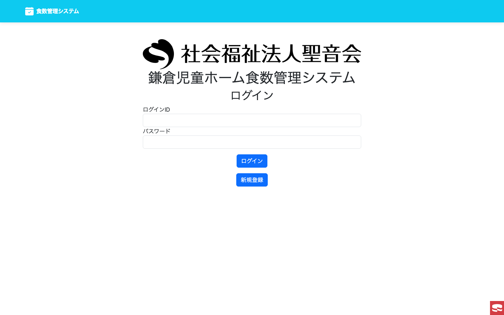
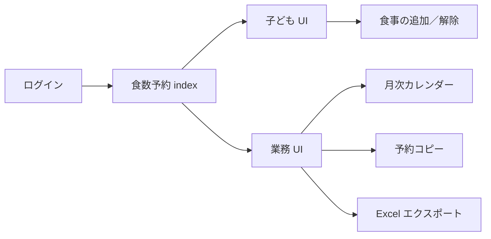
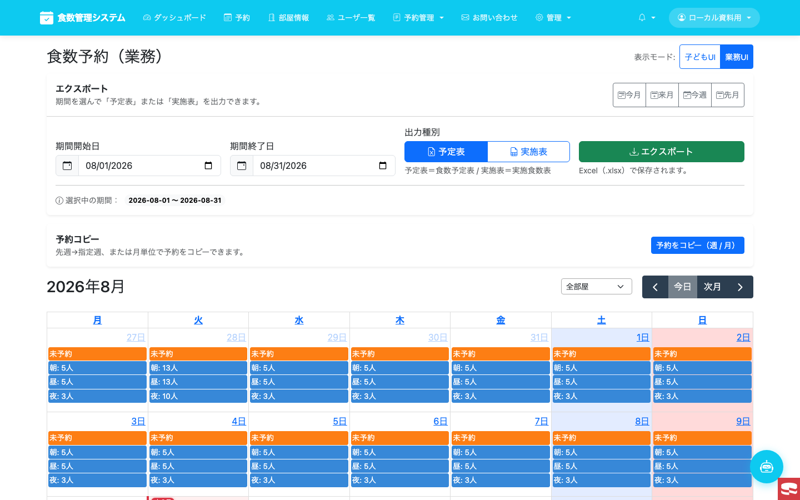

# 概要設計書（PowerPoint 原稿）— 食数予約（機能別）

> **システム全体の概要**はこちらを優先してください:  
> [`docs/system-overview/01-overview-design-ppt.md`](../system-overview/01-overview-design-ppt.md)  
> （ダッシュボード・ユーザー・単価・控除・監査・AI 等を含む）

| 項目 | 内容 |
|------|------|
| 文書種別 | 概要設計書（スライド化用 Markdown）／**食数予約に特化** |
| 対象 | 食数予約（予約カレンダー／業務・子ども UI） |
| 実装状態 | **main で稼働中** |
| スクショ方針 | **ローカル Docker のみ**（本番 URL・監視機能は対象外） |
| ローカルアカウント | `local_docs` / `LocalDocs#2026` |
| ローカル入口 | `/Users/oohashikazuyuki/shokusuu1/docs/reservation-calendar/01-overview-design-ppt.md` |

> 各 `## スライド` が PowerPoint 1 枚分。画像は相対パス＋絶対パス。

---

## スライド 1 — 表紙

**タイトル:** 食数予約 概要設計書  
**サブ:** shokusuu1 / TReservationInfo  
**注:** 本資料はローカル環境の画面で説明する（本番アクセスなし）

---

## スライド 2 — 一言で言うと

利用者・職員が **日付ごとに朝／昼／夜／弁の食数を予約・変更**し、  
管理者は **カレンダーで部屋横断の件数を把握**し、**予定表／実施表を Excel 出力**できる。

---

## スライド 3 — ログイン（入口）



絶対パス: `/Users/oohashikazuyuki/shokusuu1/docs/reservation-calendar/screenshots/01-login.png`

- 画面: `/MUserInfo/login`
- 資料用アカウント: `local_docs`（管理者・部屋1所属）

---

## スライド 4 — 全体構成



主要ルート: `/TReservationInfo`（`uimode=kid` / `uimode=biz` で切替可）

---

## スライド 5 — 業務 UI（カレンダー）



絶対パス: `/Users/oohashikazuyuki/shokusuu1/docs/reservation-calendar/screenshots/04-reservation-biz.png`

| 要素 | 説明 |
|------|------|
| UI 切替 | 子ども UI / 業務 UI |
| カレンダー | 日別・朝昼夜の人数、未予約バッジ |
| 部屋フィルタ | 全部屋／所属部屋 |
| 予約コピー | 週／月単位でコピー |

---

## スライド 6 — 子ども UI（日次カード）


絶対パス: `/Users/oohashikazuyuki/shokusuu1/docs/reservation-calendar/screenshots/03-reservation-kid.png`

- 日付カードごとに **朝／昼／夜／弁** の追加操作
- 現在の予約状態（未予約／予約済み）をその場で確認

---

## スライド 7 — 機能一覧

| ID | 機能 | 主な利用者 |
|----|------|------------|
| F-01 | 食数の予約・変更（即時トグル含む） | 利用者／職員 |
| F-02 | 子ども UI / 業務 UI 切替 | 全員（権限に応じ表示） |
| F-03 | 月次カレンダー（部屋別件数） | 職員／管理者 |
| F-04 | 予約コピー（週／月） | 職員／管理者 |
| F-05 | 予定表・実施表の Excel 出力 | 管理者 |

---

## スライド 8 — エクスポート


絶対パス: `/Users/oohashikazuyuki/shokusuu1/docs/reservation-calendar/screenshots/05-export-panel.png`

- 期間プリセット: 今月／来月／今週／先月
- 出力種別: **予定表** / **実施表**
- 形式: Excel（`.xlsx`）

---

## スライド 9 — 画面遷移（利用者視点）

1. ログイン  
2. 食数予約を開く  
3. UI を選ぶ（子ども／業務）  
4. 日付の食事を追加・変更  
5.（管理者）期間を選んで Excel 出力

---

## スライド 10 — In / Out of Scope

**In**

- 食数予約の画面・カレンダー・コピー・Excel 出力
- ローカル検証用アカウントでの操作説明

**Out**

- 死活監視・リソース監視・Slack 通知
- 本番 URL へのアクセス
- 請求・集計の詳細仕様（別資料）

---

## スライド 11 — まとめ

1. **食数予約がメイン画面**（ログイン後の中核）  
2. **子ども向けカード**と**業務向けカレンダー**の二系統  
3. **コピーと Excel** で運用負荷を下げる  
4. 本資料の画像はすべて **ローカル** で撮影

---

## 付録 A — スクショ一覧（絶対パス）

| ファイル | 絶対パス |
|----------|----------|
| 01 ログイン | `/Users/oohashikazuyuki/shokusuu1/docs/reservation-calendar/screenshots/01-login.png` |
| 02 予約トップ | `/Users/oohashikazuyuki/shokusuu1/docs/reservation-calendar/screenshots/02-reservation-index.png` |
| 03 子ども UI | `/Users/oohashikazuyuki/shokusuu1/docs/reservation-calendar/screenshots/03-reservation-kid.png` |
| 04 業務 UI | `/Users/oohashikazuyuki/shokusuu1/docs/reservation-calendar/screenshots/04-reservation-biz.png` |
| 05 エクスポート | `/Users/oohashikazuyuki/shokusuu1/docs/reservation-calendar/screenshots/05-export-panel.png` |
| 06 ヘッダー | `/Users/oohashikazuyuki/shokusuu1/docs/reservation-calendar/screenshots/06-header-nav.png` |
| 07 食事操作 | `/Users/oohashikazuyuki/shokusuu1/docs/reservation-calendar/screenshots/07-meal-actions.png` |

```bash
open /Users/oohashikazuyuki/shokusuu1/docs/reservation-calendar/01-overview-design-ppt.md
open /Users/oohashikazuyuki/shokusuu1/docs/reservation-calendar/screenshots
```

## 付録 B — ローカルアカウント

| 項目 | 値 |
|------|-----|
| ログイン ID | `local_docs` |
| パスワード | `LocalDocs#2026` |
| 権限 | 管理者（`i_admin=3`）・部屋1所属 |
| 用途 | 資料用スクショのみ |
