# 概要設計書（PowerPoint 原稿）— 食数管理システム全体

| 項目 | 内容 |
|------|------|
| 文書種別 | 概要設計書（スライド化用 Markdown）／**システム全体** |
| 対象 | shokusuu1（食数管理システム）main 稼働機能一式 |
| 実装状態 | **main で稼働中** |
| スクショ方針 | **ローカル Docker のみ**（本番 URL・死活監視は対象外） |
| ローカルアカウント | `local_docs` / `LocalDocs#2026`（システム管理者） |
| ローカル入口 | `/Users/oohashikazuyuki/shokusuu1/docs/system-overview/01-overview-design-ppt.md` |

> 各 `## スライド` ≒ PowerPoint 1 枚。画像は相対パス＋絶対パス。

---

## スライド 1 — 表紙

**タイトル:** 食数管理システム 全体概要設計書  
**サブ:** shokusuu1 / CakePHP  
**注:** ローカル環境の画面で説明（本番・監視機能は含まない）

---

## スライド 2 — 一言で言うと

児童ホーム等の施設で、**誰が・いつ・どの食事を取るか**を予約し、  
**実食・承認・単価・控除・部屋異動**まで一連で管理する Web システム。

---

## スライド 3 — 全体マップ（機能群）

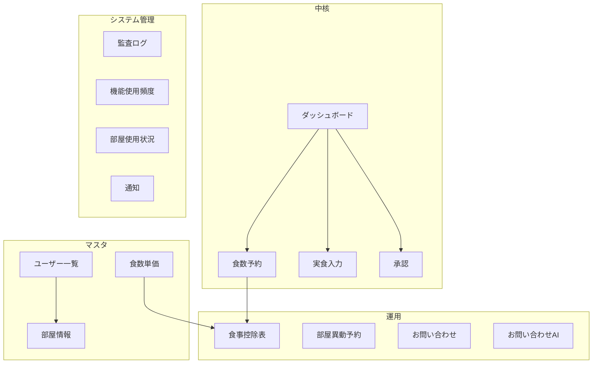

---

## スライド 4 — ログイン


絶対パス: `/Users/oohashikazuyuki/shokusuu1/docs/system-overview/screenshots/01-login.png`

- `/MUserInfo/login`
- 資料用: `local_docs`（システム管理者・部屋1所属）

---

## スライド 5 — ダッシュボード（ホーム）

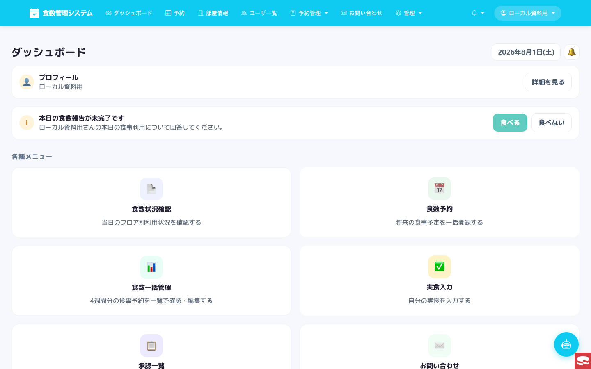

絶対パス: `/Users/oohashikazuyuki/shokusuu1/docs/system-overview/screenshots/02-dashboard.png`

| 要素 | 内容 |
|------|------|
| 本日の食数報告 | 食べる／食べない |
| 食数状況確認 | 当日フロア別利用 |
| 食数予約 | 将来予定の登録 |
| 食数一括管理 | 4週間一覧編集 |
| 実食入力 | 自分の実食 |
| 承認一覧 | ブロック長／管理者承認 |
| お問い合わせ | 連絡窓口 |

---

## スライド 6 — 食数予約（業務 UI）


絶対パス: `/Users/oohashikazuyuki/shokusuu1/docs/system-overview/screenshots/03-reservation-biz.png`

- 月次カレンダー・部屋フィルタ・件数表示
- 予約コピー（週／月）
- Excel：予定表／実施表エクスポート

---

## スライド 7 — 食数予約（子ども UI）


絶対パス: `/Users/oohashikazuyuki/shokusuu1/docs/system-overview/screenshots/04-reservation-kid.png`

- 日付カードで朝／昼／夜／弁を即時トグル
- `uimode=kid` / `uimode=biz` で切替

---

## スライド 8 — 部屋情報

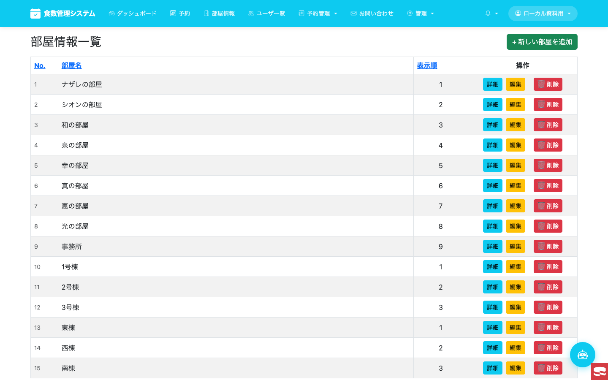

絶対パス: `/Users/oohashikazuyuki/shokusuu1/docs/system-overview/screenshots/05-rooms.png`

- `/MRoomInfo/` … 部屋マスタの一覧・追加・編集

---

## スライド 9 — ユーザー一覧

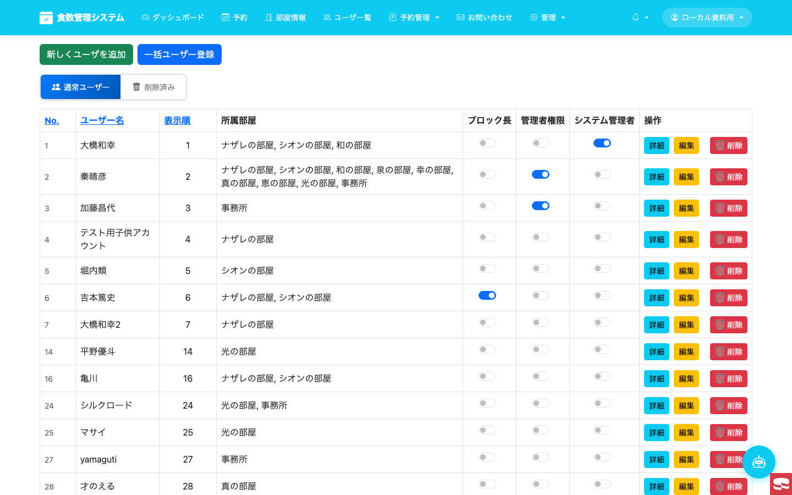

絶対パス: `/Users/oohashikazuyuki/shokusuu1/docs/system-overview/screenshots/06-users.png`

| 機能 | 内容 |
|------|------|
| 追加／一括登録 | ユーザー作成 |
| 所属部屋 | 最大2部屋など運用ルール |
| 権限トグル | ブロック長／管理者／システム管理者 |
| 削除／復元 | 論理削除タブ |

---

## スライド 10 — 予約管理：単価・控除・異動

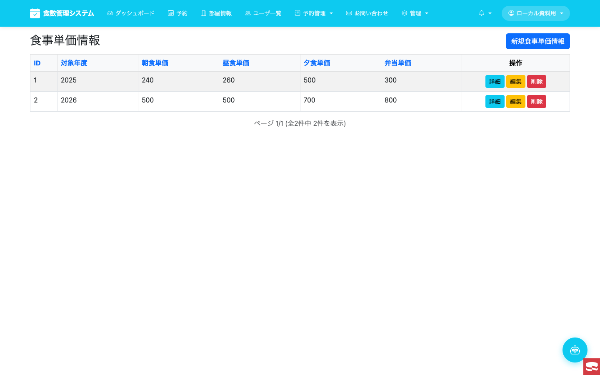

絶対パス: `/Users/oohashikazuyuki/shokusuu1/docs/system-overview/screenshots/07-meal-prices.png`

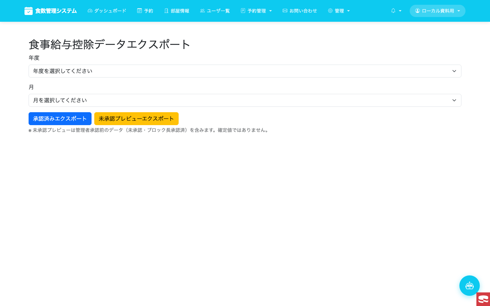

絶対パス: `/Users/oohashikazuyuki/shokusuu1/docs/system-overview/screenshots/08-meal-summary.png`

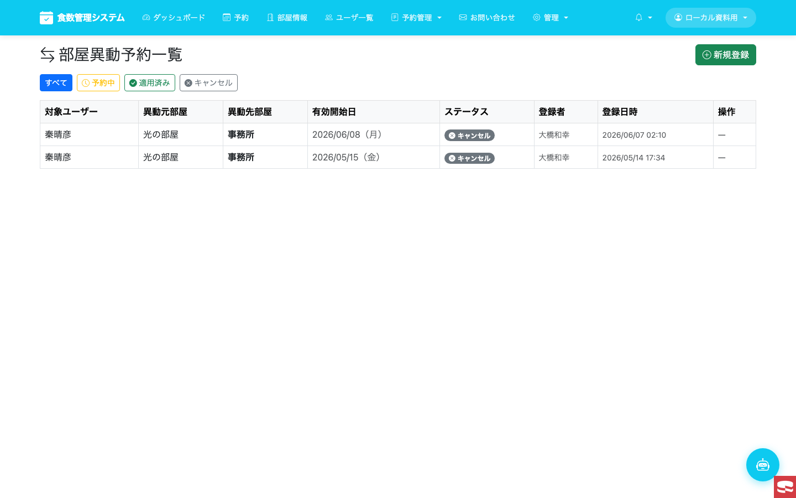

絶対パス: `/Users/oohashikazuyuki/shokusuu1/docs/system-overview/screenshots/09-room-transfer.png`

| 画面 | パス | 役割 |
|------|------|------|
| 食数単価一覧 | `/MMealPriceInfo` | 単価マスタ |
| 食事控除表 | `/MMealPriceInfo/GetMealSummary` | 控除集計・出力 |
| 部屋異動予約 | `/MRoomTransferSchedule` | 所属部屋の将来異動 |

---

## スライド 11 — お問い合わせ／通知／AI

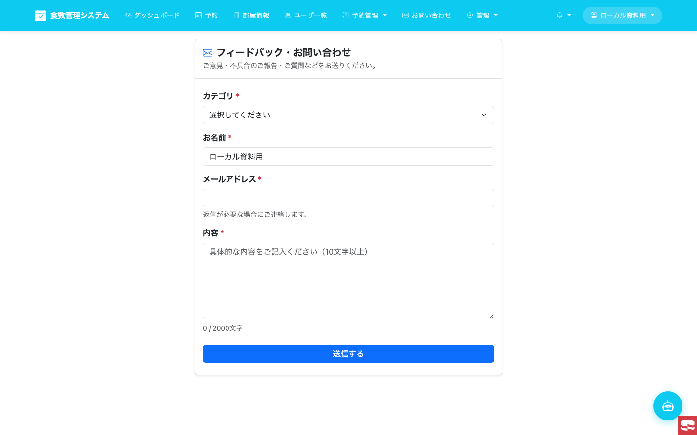

絶対パス: `/Users/oohashikazuyuki/shokusuu1/docs/system-overview/screenshots/10-contacts.png`

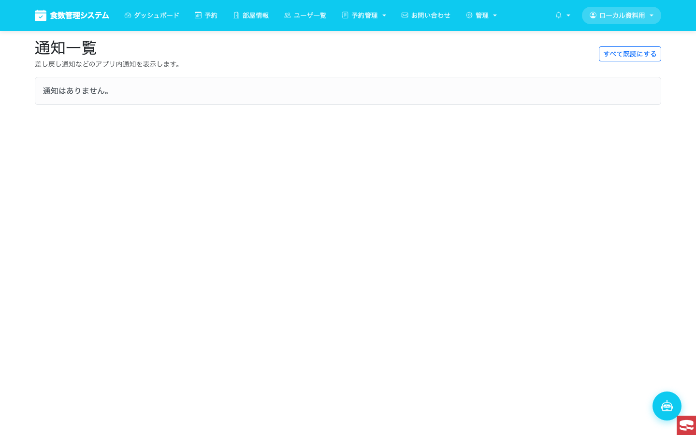

絶対パス: `/Users/oohashikazuyuki/shokusuu1/docs/system-overview/screenshots/13-notifications.png`

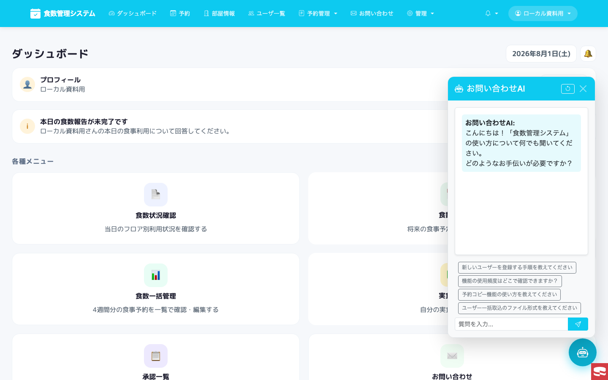

絶対パス: `/Users/oohashikazuyuki/shokusuu1/docs/system-overview/screenshots/15-ai-assistant.png`

- Contacts … 問い合わせ起票／管理者対応
- Notifications … 未読・既読
- AiAssistant FAB … 画面右下の質問ボット

---

## スライド 12 — システム管理

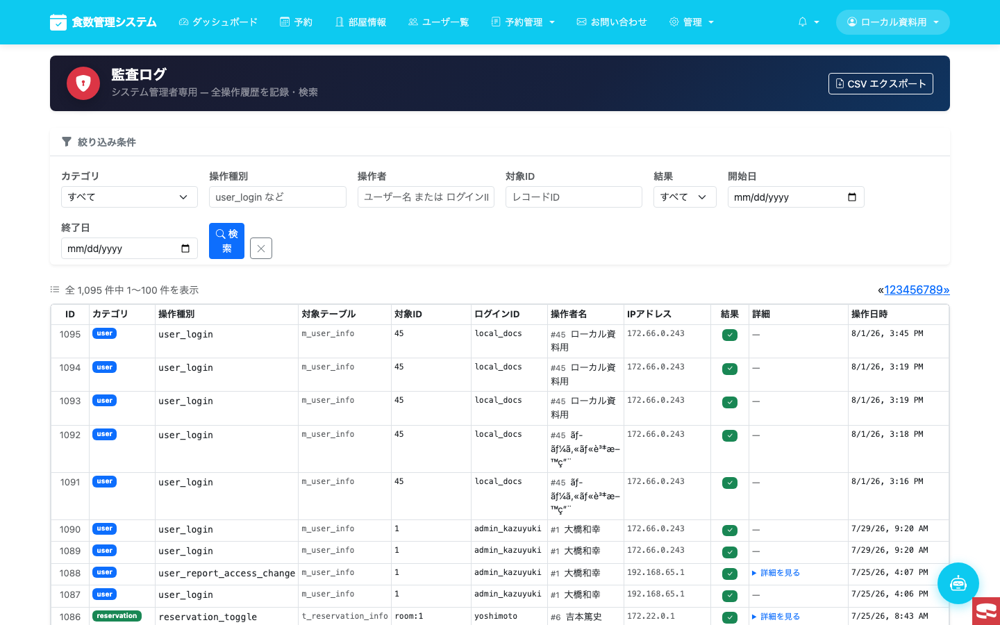

絶対パス: `/Users/oohashikazuyuki/shokusuu1/docs/system-overview/screenshots/11-audit-log.png`

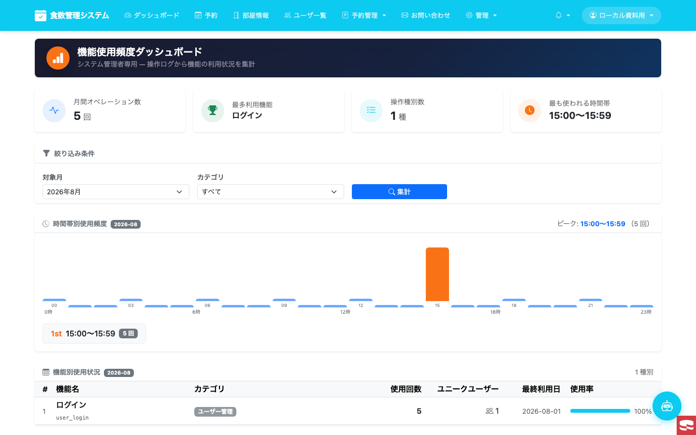

絶対パス: `/Users/oohashikazuyuki/shokusuu1/docs/system-overview/screenshots/12-feature-usage.png`

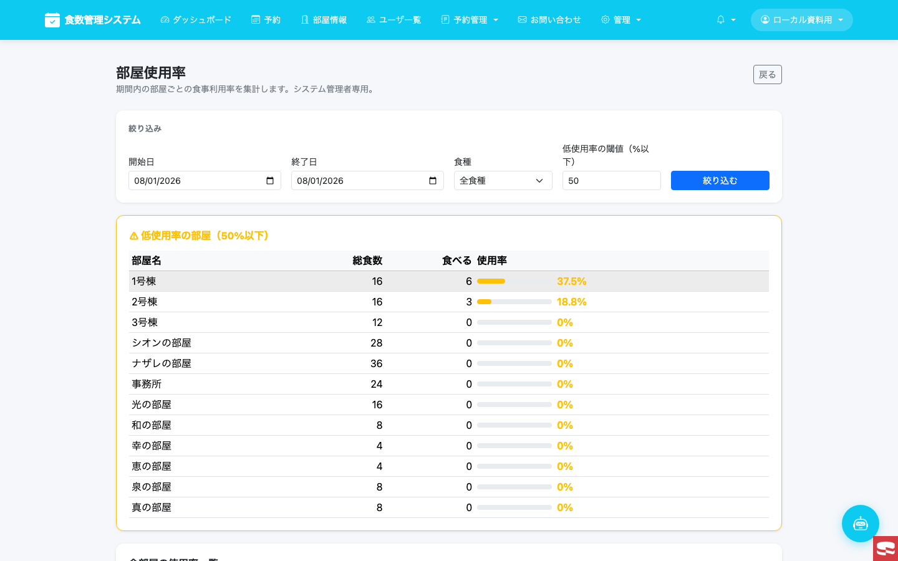

絶対パス: `/Users/oohashikazuyuki/shokusuu1/docs/system-overview/screenshots/14-room-usage.png`

| 画面 | 権限 | 役割 |
|------|------|------|
| 監査ログ | システム管理者 | 操作履歴・CSV |
| 機能使用頻度 | システム管理者 | 利用状況集計 |
| 部屋使用状況 | （RoomUsage） | 部屋の利用可視化 |

---

## スライド 13 — プロフィール

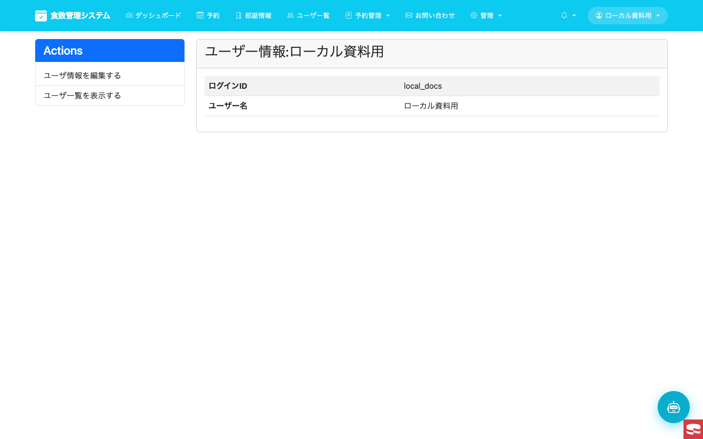

絶対パス: `/Users/oohashikazuyuki/shokusuu1/docs/system-overview/screenshots/16-profile.png`

- プロフィール閲覧・パスワード変更（一般／管理者）

---

## スライド 14 — 機能一覧（一覧表）

| ID | 機能 | 主な画面 |
|----|------|----------|
| F-01 | ログイン／ログアウト | MUserInfo/login |
| F-02 | ダッシュボード | Pages/dashboard |
| F-03 | 食数予約（業務・子ども） | TReservationInfo |
| F-04 | 実食入力・承認 | ダッシュボード導線 |
| F-05 | 部屋マスタ | MRoomInfo |
| F-06 | ユーザー・権限 | MUserInfo |
| F-07 | 食数単価 | MMealPriceInfo |
| F-08 | 食事控除表 | GetMealSummary |
| F-09 | 部屋異動予約 | MRoomTransferSchedule |
| F-10 | お問い合わせ | Contacts |
| F-11 | 通知 | Notifications |
| F-12 | お問い合わせAI | AiAssistant |
| F-13 | 監査ログ | AuditLog |
| F-14 | 機能使用頻度 | FeatureUsageSummary |
| F-15 | 部屋使用状況 | RoomUsage |

---

## スライド 15 — 利用者ロール

| ロール | 目安 | 見えるもの |
|--------|------|------------|
| 子ども／一般 | `i_user_level=1` 等 | 予約（子ども UI）・通知 |
| 職員 | level 0/7 | ダッシュボード・予約・部屋 |
| 管理者 | `i_admin=1` | ユーザー・予約管理 |
| システム管理者 | `i_admin=3` | 監査ログ・使用頻度など |

---

## スライド 16 — In / Out of Scope

**In**

- 上記 F-01〜F-15 のアプリ画面と導線
- ローカル検証用アカウントでの操作説明

**Out**

- 死活監視・リソース監視・Slack 通知（GitHub Actions）
- 本番 URL へのアクセス
- 各機能の詳細設計・API 仕様（別資料）

---

## スライド 17 — まとめ

1. **ダッシュボードが入口**、予約・実食・承認へ分岐する  
2. **マスタ（部屋・ユーザー・単価）** が予約・控除の前提  
3. **お問い合わせ／通知／AI** が利用者サポート  
4. **監査・使用頻度** がシステム管理者向けガバナンス  
5. 本資料の画像はすべて **ローカル** で撮影

---

## 付録 A — スクショ一覧（絶対パス）

| # | 内容 | 絶対パス |
|---|------|----------|
| 01 | ログイン | `/Users/oohashikazuyuki/shokusuu1/docs/system-overview/screenshots/01-login.png` |
| 02 | ダッシュボード | `/Users/oohashikazuyuki/shokusuu1/docs/system-overview/screenshots/02-dashboard.png` |
| 03 | 予約（業務） | `/Users/oohashikazuyuki/shokusuu1/docs/system-overview/screenshots/03-reservation-biz.png` |
| 04 | 予約（子ども） | `/Users/oohashikazuyuki/shokusuu1/docs/system-overview/screenshots/04-reservation-kid.png` |
| 05 | 部屋情報 | `/Users/oohashikazuyuki/shokusuu1/docs/system-overview/screenshots/05-rooms.png` |
| 06 | ユーザー一覧 | `/Users/oohashikazuyuki/shokusuu1/docs/system-overview/screenshots/06-users.png` |
| 07 | 食数単価 | `/Users/oohashikazuyuki/shokusuu1/docs/system-overview/screenshots/07-meal-prices.png` |
| 08 | 食事控除表 | `/Users/oohashikazuyuki/shokusuu1/docs/system-overview/screenshots/08-meal-summary.png` |
| 09 | 部屋異動 | `/Users/oohashikazuyuki/shokusuu1/docs/system-overview/screenshots/09-room-transfer.png` |
| 10 | お問い合わせ | `/Users/oohashikazuyuki/shokusuu1/docs/system-overview/screenshots/10-contacts.png` |
| 11 | 監査ログ | `/Users/oohashikazuyuki/shokusuu1/docs/system-overview/screenshots/11-audit-log.png` |
| 12 | 機能使用頻度 | `/Users/oohashikazuyuki/shokusuu1/docs/system-overview/screenshots/12-feature-usage.png` |
| 13 | 通知 | `/Users/oohashikazuyuki/shokusuu1/docs/system-overview/screenshots/13-notifications.png` |
| 14 | 部屋使用状況 | `/Users/oohashikazuyuki/shokusuu1/docs/system-overview/screenshots/14-room-usage.png` |
| 15 | お問い合わせAI | `/Users/oohashikazuyuki/shokusuu1/docs/system-overview/screenshots/15-ai-assistant.png` |
| 16 | プロフィール | `/Users/oohashikazuyuki/shokusuu1/docs/system-overview/screenshots/16-profile.png` |

```bash
open /Users/oohashikazuyuki/shokusuu1/docs/system-overview/01-overview-design-ppt.md
open /Users/oohashikazuyuki/shokusuu1/docs/system-overview/screenshots
```

## 付録 B — ローカルアカウント

| 項目 | 値 |
|------|-----|
| ログイン ID | `local_docs` |
| パスワード | `LocalDocs#2026` |
| 権限 | システム管理者（`i_admin=3`） |
| 用途 | 全体概要資料用スクショ |
