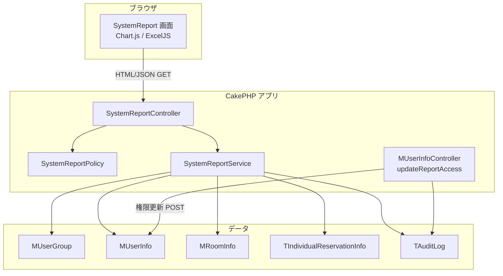

# システムレポート機能 概要設計書

| 項目 | 内容 |
|------|------|
| 文書ID | SR-OV-001 |
| 対象機能 | システムレポート（Issue #558 / Backlog SHOKUSU-10） |
| 対象システム | shokusuu1（食数管理システム） |
| 版 | 1.0 |
| 作成日 | 2026-07-25 |
| 準拠実装 | ブランチ `feature/558-system-report` |

---

## 1. 文書の目的

本ドキュメントは、システムレポート機能の**目的・スコープ・全体構成・主要設計方針**を定義し、基本設計・詳細設計の前提とする。

関連文書:

| 文書 | ファイル |
|------|----------|
| 基本設計書 | [02-basic-design.md](./02-basic-design.md) |
| 詳細設計書 | [03-detailed-design.md](./03-detailed-design.md) |

---

## 2. 背景と課題

食数管理システムでは、施設内の予約状況・使用状況を横断的に把握する手段が不足していた。システム管理者が個別画面を横断して確認する運用は、期間比較や報告資料作成の負荷が高い。

また、当初要件では「システム管理者のみ閲覧」としていたが、運用上は**システム管理者以外の担当者にもレポート閲覧だけを委譲**したいケースがある。管理権限（`i_admin`）と閲覧権限を分離する必要がある。

---

## 3. 目的

1. 指定期間における**部屋別の予約使用率**を可視化する  
2. 指定期間における**日別の子供予約総数**を可視化する  
3. 指定期間における**ログイン成功状況**を可視化する  
4. 同一集計結果を **Excel（.xlsx）** としてダウンロード可能にする  
5. 集計から特定ユーザーを除外できるようにする  
6. レポート閲覧を **専用フラグ** で制御し、システム管理者が付与・剥奪できるようにする  

---

## 4. スコープ

### 4.1 対象範囲（In Scope）

| # | 内容 |
|---|------|
| 1 | 部屋別使用率画面（グラフ・表・Excel） |
| 2 | 日別子供総数画面（グラフ・表・Excel） |
| 3 | ログイン情報画面（グラフ・表・履歴・Excel） |
| 4 | 集計期間フィルタ（開始日・終了日） |
| 5 | 集計除外ユーザー選択（部屋別・日別子供） |
| 6 | `m_user_info.i_report_access` による閲覧制御 |
| 7 | ユーザー一覧からのレポート閲覧権限トグル（システム管理者のみ） |
| 8 | 権限変更の監査ログ記録 |

### 4.2 対象外（Out of Scope）

| # | 内容 | 備考 |
|---|------|------|
| 1 | サーバーサイドでの Excel 生成 | ブラウザ内（ExcelJS）で完結 |
| 2 | 除外ユーザー設定の DB 永続化 | セッション保持とする |
| 3 | ログイン失敗ログの画面・Excel 表示 | API には含むが UI は成功専用 |
| 4 | テナント横断の横断集計 UI | 既存データモデルの範囲内で集計 |
| 5 | クリーンアーキ Domain/Application 層への完全移行 | 既存 CakePHP Service 構成で実装（将来課題） |
| 6 | 本機能専用の自動テスト一式 | 別途整備 |

---

## 5. 利用者と利用シーン

| 利用者 | 前提 | 主な利用 |
|--------|------|----------|
| レポート閲覧者 | `i_report_access = 1` | 3画面の閲覧・Excel 出力 |
| システム管理者 | `i_admin = 3` | ユーザーへのレポート権限付与／剥奪 |
| 一般ユーザー等 | 上記以外 | アクセス不可（リダイレクトまたは 403） |

**利用シーン例**

- 月次で部屋ごとの使用率を確認し、施設運営報告に添付する  
- 子供の予約件数推移を日別で把握する  
- 誰がいつログインしたかを確認する（成功履歴）  

---

## 6. 全体構成（論理）

---

## 7. 主要設計方針

### 7.1 アクセス制御方針

| 方針 | 内容 |
|------|------|
| 閲覧 | `i_report_access === 1` のみ許可（`i_admin` 単独では不可） |
| 付与 | `i_admin === 3`（システム管理者）のみ操作可 |
| 分離 | 管理メニュー内の監査ログ等は従来どおりシステム管理者専用。レポートはフラグで分離 |

当初要件の「システム管理者のみ」から、運用柔軟性のため **専用フラグ方式** に拡張した。

### 7.2 可視化・出力方針

| 項目 | 方針 |
|------|------|
| グラフ | フロントエンド Chart.js（CDN + SRI） |
| Excel | フロントエンド ExcelJS（CDN + SRI）。サーバーは JSON のみ提供 |
| グラフ画像 | `canvas.toDataURL()` を Excel に埋め込み |
| 背景 | 印刷・貼付を想定しグラフ背景を白固定 |

### 7.3 集計方針

| 項目 | 方針 |
|------|------|
| 子供／大人 | `i_user_level === 1` を子供、それ以外を大人 |
| 有効予約 | 直近14日以内は `i_change_flag`、それ以外は `eat_flag`（詳細設計参照） |
| 使用率 | 子供・大人を**独立**に算出（合計 100% にはならない） |
| 期間上限 | 最大 366 日（パフォーマンス・メモリ保護） |
| 削除データ | 削除済みユーザー／部屋は集計対象外 |

### 7.4 除外ユーザー方針

| 項目 | 方針 |
|------|------|
| 保存先 | セッション（DB テーブルは設けない） |
| キー | 部屋別と日別子供で独立 |
| 反映範囲 | グラフ・表・Excel すべて |

### 7.5 アーキテクチャ上の位置づけ

現行実装は既存 CakePHP の **Controller / Service / Policy / Template** 構成とする。  
プロジェクト全体のクリーンアーキ方針（Domain / Application）への移管は本機能の将来課題とし、概要設計時点ではスコープ外とする。

---

## 8. 画面構成（概要）

| 画面名 | パス | 概要 |
|--------|------|------|
| 部屋別使用率 | `/SystemReport` | 部屋×子供/大人の人数・予約数・使用率 |
| 日別子供総数 | `/SystemReport/dailyChildren` | 日付ごとの子供予約件数 |
| ログイン情報 | `/SystemReport/loginReport` | ユーザー別ログイン回数・成功履歴 |

各画面はサブナビで相互遷移する。ページ表示時に自動集計する。

---

## 9. 外部依存

| ライブラリ | バージョン | 用途 | 読み込み |
|------------|------------|------|----------|
| Chart.js | 4.4.3 | グラフ描画 | CDN + integrity + crossorigin |
| ExcelJS | 4.4.0 | xlsx 生成 | 同上 |
| Bootstrap Icons | 既存レイアウト準拠 | ボタンアイコン | 既存 |

新規サーバーサイドライブラリ（PHPSpreadsheet 等）は導入しない。

---

## 10. 非機能要件（概要）

| 区分 | 要件 |
|------|------|
| セキュリティ | 認可ポリシー必須。例外詳細はクライアント非露出。マスアサイン不可。SRI 付与 |
| 性能 | 集計期間を最大 366 日に制限。過剰な同時表示はクライアント側で最新リクエストのみ採用 |
| 可用性 | 集計失敗時は固定メッセージの JSON / Flash。ログに詳細を記録 |
| 監査 | レポート権限変更を `user_report_access_change` として記録 |
| 運用 | マイグレーション適用後に利用可能 |

---

## 11. リスクと対策

| リスク | 影響 | 対策 |
|--------|------|------|
| 長期間集計によるメモリ・応答遅延 | 高 | 366 日上限、将来は DB 側集計へ |
| CDN 改ざん | 中 | SRI + crossorigin |
| 権限の自己付与 | 高 | `i_report_access` を mass-assign 不可。更新 API はシステム管理者のみ |
| 集計条件と Excel 内容の不一致 | 中 | 集計結果スナップショットを保持。条件変更時は Excel 無効化 |
| ログイン失敗の非表示 | 低 | 成功専用レポートとして仕様確定。必要なら別画面で拡張 |

---

## 12. 受け入れ条件（概要レベル）

- [ ] `i_report_access = 0` のユーザーはレポート画面・API にアクセスできない  
- [ ] `i_report_access = 1` のユーザーは 3 画面を閲覧できる  
- [ ] システム管理者はユーザー一覧からレポート閲覧権限を付与・剥奪できる  
- [ ] 期間指定・除外ユーザー指定で集計結果が変わる  
- [ ] Excel 出力でグラフ画像付きの xlsx が得られる  
- [ ] 除外ユーザーはグラフ・表・Excel のいずれにも含まれない  

---

## 13. 改訂履歴

| 版 | 日付 | 内容 |
|----|------|------|
| 1.0 | 2026-07-25 | 初版（実装 `feature/558-system-report` に基づく） |
