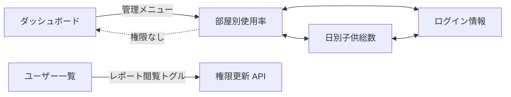
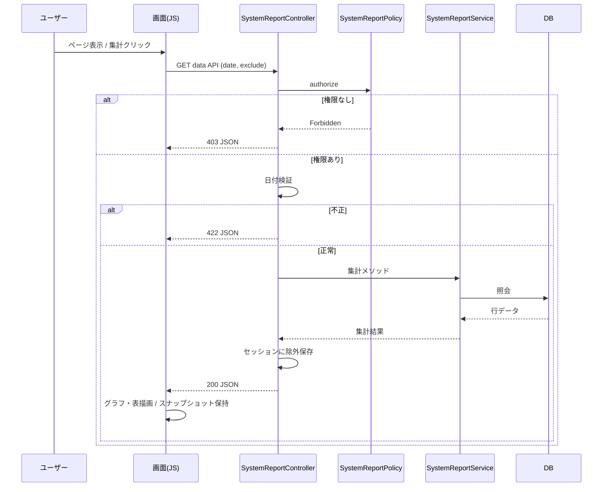

# システムレポート機能 基本設計書

| 項目 | 内容 |
|------|------|
| 文書ID | SR-BD-001 |
| 対象機能 | システムレポート（Issue #558 / Backlog SHOKUSU-10） |
| 版 | 1.0 |
| 作成日 | 2026-07-25 |
| 上位文書 | [01-overview-design.md](./01-overview-design.md) |
| 下位文書 | [03-detailed-design.md](./03-detailed-design.md) |

---

## 1. 文書の目的

本ドキュメントは、システムレポート機能の**画面・API・認可・データモデル・処理フロー**を定義し、詳細設計・実装・テストの基準とする。

---

## 2. 機能一覧

| 機能ID | 機能名 | 概要 | 権限 |
|--------|--------|------|------|
| F-01 | 部屋別使用率表示 | 棒グラフ・表で部屋別使用率を表示 | レポート閲覧 |
| F-02 | 部屋別使用率 API | JSON で部屋別集計を返却 | レポート閲覧 |
| F-03 | 日別子供総数表示 | 折れ線・表で日別子供予約件数を表示 | レポート閲覧 |
| F-04 | 日別子供総数 API | JSON で日別子供件数を返却 | レポート閲覧 |
| F-05 | ログイン情報表示 | ユーザー別回数・成功履歴を表示 | レポート閲覧 |
| F-06 | ログイン情報 API | JSON で日別件数・ログを返却 | レポート閲覧 |
| F-07 | Excel 出力 | 画面ごとに xlsx をクライアント生成 | レポート閲覧 |
| F-08 | 集計除外ユーザー設定 | 除外選択・リセット・セッション保持 | レポート閲覧 |
| F-09 | レポート権限更新 | ユーザー一覧トグルで付与／剥奪 | システム管理者 |

---

## 3. 画面設計

### 3.1 画面遷移



### 3.2 メニュー表示条件

| メニュー要素 | 表示条件 |
|--------------|----------|
| 「管理」ドロップダウン自体 | `i_admin === 3` **または** `i_report_access === 1` |
| 監査ログ / 機能使用頻度 | `i_admin === 3` のみ |
| システムレポート 3 リンク | `i_report_access === 1` のみ |

※システム管理者でも `i_report_access = 0` の場合、レポートリンクは表示されない。

### 3.3 部屋別使用率（F-01）

| 項目 | 内容 |
|------|------|
| パス | `GET /SystemReport` |
| タイトル | システムレポート — 部屋別使用率 |
| 入力 | 開始日・終了日（既定: 当月1日〜当日） |
| 除外 UI | 全有効ユーザー（大人→子供順）。バッジ「大」「子」 |
| グラフ | 部屋別 予約使用率（子供／大人）棒グラフ |
| 注記 | 「子供% + 大人% = 100% ではありません」 |
| 表 | 部屋名 / 子供(人数・予約数・使用率) / 大人(同) |
| 操作 | 集計 / Excel出力 / 除外リセット / サブナビ |
| セッション | `SystemReport.excludeUserIds` |

### 3.4 日別子供総数（F-03）

| 項目 | 内容 |
|------|------|
| パス | `GET /SystemReport/dailyChildren` |
| タイトル | システムレポート — 日別子供総数 |
| 除外 UI | **子供のみ**表示 |
| グラフ | 日別 子供 予約総数（折れ線） |
| 表 | 日付 / 子供 予約件数 |
| セッション | `SystemReport.excludeChildIds` |

### 3.5 ログイン情報（F-05）

| 項目 | 内容 |
|------|------|
| パス | `GET /SystemReport/loginReport` |
| タイトル | システムレポート — ログイン情報 |
| 入力 | 開始日・終了日のみ（除外ユーザーなし） |
| サマリー | ログイン成功総数 / ユニークユーザー数 / 集計日数 |
| グラフ | ユーザー別ログイン回数（横棒） |
| 表1 | ユーザー名 / ログインID / ログイン回数 / 最終ログイン |
| 表2 | ログイン履歴（日時 / ユーザー名 / ログインID / IP）※成功のみ |
| 表示方針 | API の失敗ログは画面・Excel に出さない（成功専用） |

### 3.6 共通 UI 挙動

| 項目 | 仕様 |
|------|------|
| 初回表示 | `DOMContentLoaded` で自動集計 |
| ローディング | 全画面オーバーレイ |
| 条件変更 | 日付・除外変更時に Excel を無効化し、再集計後に有効化 |
| 同時リクエスト | 最新リクエスト ID のみ画面反映 |
| 除外操作 | checkbox の `change` で状態更新（二重トグル禁止） |
| アクセシビリティ | チェックボックスは視覚的に隠し、フォーカス可能。`:focus-within` で輪郭表示 |

### 3.7 ユーザー一覧 — レポート閲覧（F-09）

| 項目 | 内容 |
|------|------|
| 画面 | `MUserInfo/index` |
| 表示 | システム管理者のみ「レポート閲覧」列 |
| 操作 | トグルスイッチ。確認ダイアログ後に POST |
| メッセージ | 付与／削除の確認文、成功時 Flash |

---

## 4. API 設計

### 4.1 一覧

| API ID | Method | Path | 機能 |
|--------|--------|------|------|
| A-01 | GET | `/SystemReport/data` | 部屋別集計 |
| A-02 | GET | `/SystemReport/dailyChildrenData` | 日別子供集計 |
| A-03 | GET | `/SystemReport/loginReportData` | ログイン集計 |
| A-04 | POST | `/MUserInfo/update-report-access` | 権限更新 |

すべてログイン必須。A-01〜A-03 はレポート閲覧権限、A-04 はシステム管理者権限。

### 4.2 共通リクエスト（A-01 / A-02）

| パラメータ | 型 | 必須 | 説明 |
|------------|----|------|------|
| `date_from` | string (Y-m-d) | 任意 | 未指定時は当月1日 |
| `date_to` | string (Y-m-d) | 任意 | 未指定時は当日 |
| `exclude[]` | int[] | 任意 | 除外ユーザー ID |

### 4.3 共通リクエスト（A-03）

| パラメータ | 型 | 必須 | 説明 |
|------------|----|------|------|
| `date_from` / `date_to` | string | 任意 | A-01 と同様 |

### 4.4 日付バリデーション（共通）

| 条件 | HTTP | メッセージ |
|------|------|------------|
| 形式不正 | 422 | 日付は YYYY-MM-DD 形式で指定してください。 |
| 開始日 > 終了日 | 422 | 開始日は終了日以前を指定してください。 |
| 期間 > 366 日 | 422 | 集計期間は最大 366 日までです。 |

### 4.5 レスポンス概要

#### A-01 成功 (200)

```json
{
  "room_stats": [
    {
      "room_id": 1,
      "room_name": "A部屋",
      "child_users": 10,
      "adult_users": 5,
      "child_reservations": 120,
      "adult_reservations": 40,
      "child_usage_rate": 12.5,
      "adult_usage_rate": 8.0
    }
  ],
  "date_from": "2026-07-01",
  "date_to": "2026-07-25"
}
```

#### A-02 成功 (200)

```json
{
  "stats": [
    { "date": "2026-07-01", "child_count": 12 }
  ],
  "date_from": "2026-07-01",
  "date_to": "2026-07-25"
}
```

#### A-03 成功 (200)

```json
{
  "daily": [
    { "date": "2026-07-01", "success": 3, "failed": 1 }
  ],
  "logs": [
    {
      "dt": "2026-07-01 09:15:00",
      "user_name": "山田",
      "login_id": "yamada",
      "result": 1,
      "ip": "203.0.113.10"
    }
  ],
  "date_from": "2026-07-01",
  "date_to": "2026-07-25"
}
```

#### エラー共通

```json
{ "success": false, "error": "メッセージ" }
```

| HTTP | 条件 |
|------|------|
| 403 | 権限なし |
| 422 | 入力検証エラー |
| 500 | 集計例外（詳細はサーバログのみ） |

HTML 画面で権限なしの場合は Flash 後にダッシュボードへリダイレクト。

### 4.6 A-04 権限更新

| 項目 | 内容 |
|------|------|
| Body | JSON `{ "i_id_user": number, "i_report_access": 0\|1 }` |
| Header | `X-CSRF-Token`, `Content-Type: application/json` |
| 認可 | `MUserInfoPolicy::canUpdateReportAccess`（システム管理者） |
| 監査 | `user_report_access_change` |

---

## 5. 認可設計

### 5.1 権限マトリクス

| 操作 | 一般 | 管理者 | ブロック長 | システム管理者 | レポート閲覧者 |
|------|------|--------|------------|----------------|----------------|
| レポート画面/API | × | × | × | ×※ | ○ |
| レポート権限トグル表示・更新 | × | × | × | ○ | × |
| 監査ログメニュー | × | × | × | ○ | × |

※システム管理者でも `i_report_access=1` が必要。

### 5.2 ポリシー対応

| リソース | Policy | 判定 |
|----------|--------|------|
| `SystemReportController` | `SystemReportPolicy` | `i_report_access === 1` |
| `MUserInfo`（権限更新） | `MUserInfoPolicy::canUpdateReportAccess` | システム管理者 |

---

## 6. データ設計（論理）

### 6.1 追加カラム

| テーブル | カラム | 型 | 既定 | 意味 |
|----------|--------|----|------|------|
| `m_user_info` | `i_report_access` | INT(1) NOT NULL | 0 | 1=レポート閲覧可 / 0=不可 |

### 6.2 参照テーブル（既存）

| テーブル | 用途 |
|----------|------|
| `m_user_info` | ユーザー属性・削除フラグ・レベル |
| `m_user_group` | ユーザーと部屋の所属（`active_flag=0` が現役） |
| `m_room_info` | 部屋名・削除フラグ |
| `t_individual_reservation_info` | 予約日・eat_flag・i_change_flag |
| `t_audit_log` | ログイン成功／失敗・権限変更監査 |

### 6.3 セッションデータ

| キー | 型 | 用途 |
|------|----|------|
| `SystemReport.excludeUserIds` | int[] | 部屋別除外 |
| `SystemReport.excludeChildIds` | int[] | 日別子供除外 |

data API 成功時にリクエストの除外 ID で上書き保存する。

---

## 7. 処理フロー（基本）

### 7.1 集計表示フロー



### 7.2 Excel 出力フロー

1. 直近集計のスナップショット（期間・データ）が存在すること  
2. ExcelJS でブック生成（データシート＋グラフシート等）  
3. Chart canvas を PNG として埋め込み  
4. Blob URL でダウンロード後、`revokeObjectURL`  

### 7.3 権限更新フロー

1. システム管理者がユーザー一覧のトグルを操作  
2. 確認ダイアログ  
3. `POST /MUserInfo/update-report-access`  
4. 認可 → Entity 更新（mass-assign 不使用）→ 監査ログ → 成功応答  

---

## 8. Excel 出力仕様（基本）

| 画面 | ファイル名 | 主なシート |
|------|------------|------------|
| 部屋別使用率 | `部屋別使用率_{from}_{to}.xlsx` | 部屋別データ / グラフ / 集計情報 |
| 日別子供総数 | `日別子供総数_{from}_{to}.xlsx` | 日別子供総数 / グラフ |
| ログイン情報 | `ログイン情報_{from}_{to}.xlsx` | ユーザー別集計 / グラフ / ログイン履歴 |

期間は入力欄ではなく、**集計成功時のスナップショット**を用いる。

---

## 9. 集計ルール（基本）

詳細な式・分岐は詳細設計書に記載する。基本方針のみ示す。

| 項目 | ルール |
|------|--------|
| 子供 | `i_user_level = 1` |
| 大人 | `i_user_level ≠ 1` |
| 有効予約 | 直近14日は `i_change_flag`、それ以外は `eat_flag`。値が 1 のときカウント |
| 使用率 | 予約数 ÷（ユーザー数 × 日数 × 食種4）× 100（子供・大人別） |
| 削除除外 | `i_del_flag=0` / `i_del_flg=0` |
| 所属 | 部屋別は `MUserGroup.active_flag=0` の現役所属のみ |
| ログイン対象 | `c_action IN ('user_login','user_login_failed')` |

---

## 10. コンポーネント配置

| 層（実装） | クラス / ファイル |
|------------|-------------------|
| Presentation | `SystemReportController`, `templates/SystemReport/*`, `layout/default.php` |
| Application-ish | `SystemReportService` |
| Authorization | `SystemReportPolicy`, `MUserInfoPolicy` |
| Persistence | Cake Tables / Entities, Migration `AddReportAccessToMUserInfo` |
| DI | `Application::services()` で Service / Controller をバインド |

---

## 11. エラーハンドリング方針

| 箇所 | 方針 |
|------|------|
| 認可失敗（HTML） | Flash + ダッシュボードへリダイレクト |
| 認可失敗（JSON） | 403 + 固定メッセージ |
| 入力不正 | 422 + 検証メッセージ |
| 集計例外 | Log::error（詳細）+ 500 固定メッセージ |

クライアントへ内部例外メッセージ（SQL・パス等）を返さない。

---

## 12. テスト観点（基本）

| 観点 | 確認内容 |
|------|----------|
| 認可 | フラグ 0/1、システム管理者の権限更新可否 |
| 検証 | 日付形式・前後・366日超 |
| 集計 | 除外ユーザー、削除ユーザー／部屋、子供／大人分類 |
| UI | 自動集計、二重トグルなし、条件変更で Excel 無効化 |
| Excel | ファイル名・シート構成・スナップショット期間 |
| 監査 | 権限変更ログの action / detail |

---

## 13. 改訂履歴

| 版 | 日付 | 内容 |
|----|------|------|
| 1.0 | 2026-07-25 | 初版 |
