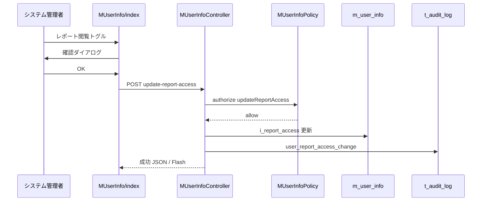

# システムレポート機能 詳細設計書

| 項目 | 内容 |
|------|------|
| 文書ID | SR-DD-001 |
| 対象機能 | システムレポート（Issue #558 / Backlog SHOKUSU-10） |
| 版 | 1.0 |
| 作成日 | 2026-07-25 |
| 上位文書 | [02-basic-design.md](./02-basic-design.md) |
| 準拠実装 | `src_web/kamaho-shokusu/` |

---

## 1. 文書の目的

本ドキュメントは、システムレポート機能の**クラス・メソッド・データ構造・集計アルゴリズム・画面 JS・エラーコード**を実装可能な粒度で定義する。

---

## 2. ファイル構成

| 種別 | パス |
|------|------|
| Controller | `src/Controller/SystemReportController.php` |
| Service | `src/Service/SystemReportService.php` |
| Policy | `src/Policy/SystemReportPolicy.php` |
| Template | `templates/SystemReport/index.php` |
| Template | `templates/SystemReport/daily_children.php` |
| Template | `templates/SystemReport/login_report.php` |
| Layout | `templates/layout/default.php`（メニュー） |
| Migration | `config/Migrations/20260718000001_AddReportAccessToMUserInfo.php` |
| Entity | `src/Model/Entity/MUserInfo.php` |
| Routes | `config/routes.php` |
| DI / Map | `src/Application.php` |
| 権限更新 | `src/Controller/MUserInfoController.php` |
| 権限 Policy | `src/Policy/MUserInfoPolicy.php` |
| ユーザー一覧 UI | `templates/MUserInfo/index.php` |

---

## 3. ルーティング詳細

| Method | URL | Controller::action |
|--------|-----|--------------------|
| GET | `/SystemReport` | `SystemReport::index` |
| GET | `/SystemReport/data` | `SystemReport::data` |
| GET | `/SystemReport/dailyChildren` | `SystemReport::dailyChildren` |
| GET | `/SystemReport/dailyChildrenData` | `SystemReport::dailyChildrenData` |
| GET | `/SystemReport/loginReport` | `SystemReport::loginReport` |
| GET | `/SystemReport/loginReportData` | `SystemReport::loginReportData` |
| POST | `/MUserInfo/update-report-access` | `MUserInfo::updateReportAccess` |

---

## 4. DI / 認可マップ

### 4.1 `Application::services()`

```text
SystemReportService
SystemReportController(SystemReportService, ServerRequest)
```

### 4.2 Policy map

```text
SystemReportController => SystemReportPolicy
```

---

## 5. クラス詳細

### 5.1 `SystemReportController`（final）

#### 定数

| 定数 | 値 | 意味 |
|------|----|------|
| `FORBIDDEN_MESSAGE` | `この機能を利用する権限がありません。` | HTML/JSON 共通 |
| `MAX_RANGE_DAYS` | `366` | 集計期間上限（両端含む） |

#### 公開メソッド

| メソッド | 認可 action | 処理概要 | 戻り |
|----------|-------------|----------|------|
| `index()` | `index` | 除外候補ユーザー取得、セッション除外復元、view 変数設定 | `?Response` |
| `data()` | `data` | パラメータ解決→集計→セッション保存→JSON | `Response` |
| `dailyChildren()` | `dailyChildren` | 日別用除外セッション復元 | `?Response` |
| `dailyChildrenData()` | `dailyChildrenData` | 日別子供集計 JSON | `Response` |
| `loginReport()` | `loginReport` | HTML のみ | `?Response` |
| `loginReportData()` | `loginReportData` | ログイン集計 JSON | `Response` |

#### 私有メソッド

| メソッド | 仕様 |
|----------|------|
| `resolveParams()` | `resolveDateRange()` + `exclude` を int[] 化（`>0` のみ） |
| `resolveDateRange()` | 既定日付・形式検証・前後関係・日数上限。失敗時 `BadRequestException` |
| `isValidYmd(string)` | `DateTimeImmutable::createFromFormat('Y-m-d')` かつ再フォーマット一致 |
| `jsonResponse(array, int=200)` | `application/json` + `JSON_UNESCAPED_UNICODE` |
| `jsonError(string, int=400)` | `{success:false, error}` |

#### 例外ハンドリング

| catch | 応答 |
|-------|------|
| `ForbiddenException`（HTML） | Flash + redirect dashboard |
| `ForbiddenException`（JSON） | 403 + FORBIDDEN_MESSAGE |
| `BadRequestException` | 422 + `$e->getMessage()`（検証メッセージのみ） |
| `\Throwable`（集計） | `Log::error` + 500「集計処理に失敗しました。」 |

---

### 5.2 `SystemReportPolicy`（final）

| メソッド | 判定 |
|----------|------|
| `canIndex` / `canData` / `canDailyChildren` / `canDailyChildrenData` / `canLoginReport` / `canLoginReportData` | `hasReportAccess($user)` |
| `hasReportAccess`（private） | identity の `i_report_access` を int 化し `=== 1` |

identity 取得: `$user->getOriginalData()`。object(`get`)/array/`ArrayAccess` を許容。

---

### 5.3 `SystemReportService`（final）

#### 定数

| 定数 | 値 |
|------|----|
| `CHILD_LEVEL` | `1` |
| `MEAL_TYPES` | `4`（朝・昼・夕・弁当） |

#### 公開メソッド一覧

| メソッド | 入力 | 出力 |
|----------|------|------|
| `getRoomStats(exclude, from, to)` | int[], Y-m-d, Y-m-d | `room_stats[]` |
| `getDailyStats(exclude, from, to)` | 同上 | 日別 child/adult/total |
| `getDailyChildrenStats(...)` | 同上 | `getDailyStats` から `date`,`child_count` のみ |
| `getLoginStats(from, to)` | Y-m-d, Y-m-d | `{daily, logs}` |
| `getAllUsers()` | なし | 除外 UI 用ユーザー一覧 |

いずれも永続化例外は上位へ伝播（Controller で捕捉）。

---

## 6. 集計アルゴリズム詳細

### 6.1 有効予約フラグ判定（共通）

入力行: `d_reservation_date`, `eat_flag`, `i_change_flag`

```text
today  = 当日 00:00:00（サーバタイムゾーン）
cutoff = today + 14 days
reservDate = Date(d_reservation_date)

isLastMinute = (reservDate >= today AND reservDate <= cutoff)

effectiveFlag =
  IF isLastMinute AND i_change_flag IS NOT NULL
    THEN (int)i_change_flag
    ELSE (int)(eat_flag ?? 0)

COUNT 対象 = (effectiveFlag === 1)
```

部屋別・日別いずれも同一。

### 6.2 `getRoomStats`

#### Step A: 母数（部屋×ユーザー）

照会:

```text
MUserGroup
  contain MUserInfo, MRoomInfo
  where:
    MUserGroup.active_flag = 0
    MUserInfo.i_del_flag   = 0
    MRoomInfo.i_del_flg    = 0
```

各行について:

1. `roomId`, `userId`, `roomName`, `userLevel` を取得  
2. `roomId<=0` / `userId<=0` / `roomName===''` → skip  
3. `userId ∈ excludeUserIds` → skip  
4. 部屋バケット初期化（予約数・使用率 0）  
5. `isChild = (userLevel === CHILD_LEVEL)`  
6. `userLevelInRoom[roomId][userId] = isChild`  
7. 子供なら `child_users++` して continue、それ以外は `adult_users++`

#### Step B: 予約加算

照会:

```text
TIndividualReservationInfo
  select: i_id_user, i_id_room, eat_flag, i_change_flag, d_reservation_date
  where: date_from <= d_reservation_date <= date_to
```

各行:

1. `userLevelInRoom[roomId][userId]` 未登録 → skip（所属外・除外・削除）  
2. effectiveFlag !== 1 → skip  
3. 子供なら `child_reservations++`、それ以外は `adult_reservations++`

#### Step C: 使用率

```text
days = max(1, (dateTo - dateFrom).days + 1)

child_capacity = child_users * days * MEAL_TYPES
adult_capacity = adult_users * days * MEAL_TYPES

child_usage_rate = child_capacity > 0
  ? round(child_reservations / child_capacity * 100, 1)
  : 0.0

adult_usage_rate = 同様（独立）
```

#### Step D: 整列

`room_name` 昇順（`strcmp`）。

#### 出力要素

| キー | 型 |
|------|----|
| `room_id` | int |
| `room_name` | string |
| `child_users` / `adult_users` | int |
| `child_reservations` / `adult_reservations` | int |
| `child_usage_rate` / `adult_usage_rate` | float |

### 6.3 `getDailyStats` / `getDailyChildrenStats`

1. `MUserInfo` から `i_del_flag=0` の `i_id_user`,`i_user_level` を取得  
2. 除外ユーザーを除き `userLevelMap[userId]=isChild`  
3. 日付バケットを from〜to 全日初期化 `{child:0, adult:0}`  
4. 予約行を期間で取得し、effectiveFlag===1 かつマップ存在日のみ加算  
5. `getDailyChildrenStats` は `date`, `child_count` のみ返却  

### 6.4 `getLoginStats`

照会:

```text
TAuditLog
  select: c_actor_user_name, c_actor_login_id, i_result, c_ip_address, dt_create
  where:
    c_action IN ('user_login', 'user_login_failed')
    dt_create BETWEEN '{from} 00:00:00' AND '{to} 23:59:59'
  order: dt_create DESC
```

処理:

1. 全日バケット `{success:0, failed:0}`  
2. `i_result === 1` → success++、それ以外 → failed++  
3. `logs[]` に全件（成功・失敗）を格納  

**画面契約:** UI/Excel は `logs` のうち `result === 1` のみ使用。`daily.failed` は画面未使用。

### 6.5 `getAllUsers`

```text
MUserInfo
  where i_del_flag = 0
  select i_id_user, c_user_name, i_user_level
```

ソート:

1. 大人（`is_child=false`）を先に  
2. 同グループ内は `c_user_name` ASC  

出力: `{ user_id, user_name, is_child }`

---

## 7. DB 詳細設計

### 7.1 マイグレーション

クラス: `AddReportAccessToMUserInfo`（final）

```text
table: m_user_info
column: i_report_access
  type: integer
  limit: 1
  null: false
  default: 0
  comment: システムレポート閲覧権限 (1=許可 0=不許可)
  after: i_admin
```

### 7.2 Entity `MUserInfo`

| 項目 | 値 |
|------|----|
| `@property` | `int $i_report_access` |
| `_accessible['i_report_access']` | **`false`**（mass-assign 禁止） |

更新は `MUserInfoController::updateReportAccess` でプロパティ直接代入のみ。

---

## 8. 権限更新詳細（`updateReportAccess`）

| 項目 | 仕様 |
|------|------|
| Method | POST JSON |
| Body | `i_id_user`（必須）, `i_report_access`（0 or 1） |
| 認可 | `$this->Authorization->authorize($user, 'updateReportAccess')` |
| 更新列 | `i_report_access`, `dt_update`, `c_update_user` |
| 監査 action | `user_report_access_change` |
| 監査 detail | `target_user_name`, `i_report_access` |
| FormProtection | `updateReportAccess` を除外アクションに登録 |

`MUserInfoPolicy::canUpdateReportAccess`: システム管理者のみ true。

---

## 9. 画面 JS 詳細

### 9.1 共通状態変数

| 変数 | 用途 |
|------|------|
| `currentStats` / `currentLogs` 等 | 表示データ |
| `statsSnapshot` | `{ dateFrom, dateTo }`（Excel 用） |
| `latestRequestId` | レース防止 |
| Chart インスタンス | 再描画前に `destroy()` |

### 9.2 fetch ヘッダ

```text
X-CSRF-Token: <meta csrfToken>
Accept: application/json
```

### 9.3 除外 UI（部屋別・日別）

| イベント | 処理 |
|----------|------|
| `change` on checkbox | `.active` 同期、件数更新、`invalidateStats()` |
| クリアボタン | 全 unchecked、invalidate |
| date change | invalidate |

`invalidateStats()`: データ空・snapshot null・Excel disabled。

**禁止:** label click で `checked = !checked` する二重トグル。

### 9.4 SRI

| URL | integrity |
|-----|-----------|
| chart.js@4.4.3/.../chart.umd.min.js | `sha384-JUh163oCRItcbPme8pYnROHQMC6fNKTBWtRG3I3I0erJkzNgL7uxKlNwcrcFKeqF` |
| exceljs@4.4.0/.../exceljs.min.js | `sha384-Pqp51FUN2/qzfxZxBCtF0stpc9ONI6MYZpVqmo8m20SoaQCzf+arZvACkLkirlPz` |

属性: `crossorigin=anonymous`

### 9.5 グラフ白背景プラグイン

Chart.js plugin `beforeDraw` で `destination-over` + `#ffffff` 矩形塗り。  
CSS: `canvas { background-color: #fff; }`

### 9.6 Excel シート詳細

#### 部屋別使用率

| シート | 内容 |
|--------|------|
| 部屋別データ | ヘッダ行 + 各部屋の人数・予約・使用率。交互行の背景色 |
| グラフ | タイトル、期間、PNG 画像 |
| 集計情報 | 期間・除外人数など |

ファイル名: `部屋別使用率_{from}_{to}.xlsx`  
creator: `システムレポート`

#### 日別子供総数

| シート | 内容 |
|--------|------|
| 日別子供総数 | 日付, 子供予約件数 |
| グラフ | タイトル・期間・PNG |

ファイル名: `日別子供総数_{from}_{to}.xlsx`

#### ログイン情報

| シート | 内容 |
|--------|------|
| ユーザー別集計 | ユーザー名, ログインID, 回数, 最終ログイン |
| グラフ | PNG |
| ログイン履歴 | 成功のみの履歴行 |

ファイル名: `ログイン情報_{from}_{to}.xlsx`

共通: `URL.createObjectURL` 後に `revokeObjectURL`。

---

## 10. メニュー実装詳細

`templates/layout/default.php`:

```text
$isSysAdmin      = ($iAdmin === 3)
$hasReportAccess = $user && (int)($user->i_report_access ?? 0) === 1

管理メニュー表示: $isSysAdmin || $hasReportAccess
監査系リンク:     $isSysAdmin
レポート3リンク:  $hasReportAccess
```

リンク:

- `/SystemReport`
- `/SystemReport/dailyChildren`
- `/SystemReport/loginReport`

---

## 11. エラーコード一覧

| HTTP | success | error 例 | 発生箇所 |
|------|---------|----------|----------|
| 403 | false | この機能を利用する権限がありません。 | Policy |
| 422 | false | 日付は YYYY-MM-DD 形式で指定してください。 | resolveDateRange |
| 422 | false | 開始日は終了日以前を指定してください。 | 同上 |
| 422 | false | 集計期間は最大 366 日までです。 | 同上 |
| 500 | false | 集計処理に失敗しました。 | Service 例外 |

---

## 12. セッションキー詳細

| キー | 書込タイミング | 読込タイミング |
|------|----------------|----------------|
| `SystemReport.excludeUserIds` | `data()` 成功前に write | `index()` |
| `SystemReport.excludeChildIds` | `dailyChildrenData()` | `dailyChildren()` |

値はリクエストの `exclude[]` を正規化した int[]。

---

## 13. セキュリティ詳細チェックリスト

| # | 対策 | 実装箇所 |
|---|------|----------|
| 1 | レポート閲覧は専用フラグ | SystemReportPolicy |
| 2 | 権限更新はシステム管理者のみ | MUserInfoPolicy |
| 3 | mass-assign 不可 | MUserInfo::_accessible |
| 4 | 例外詳細の非露出 | SystemReportController catch |
| 5 | CSRF（POST 権限更新） | meta + header |
| 6 | CDN SRI | 各 Template |
| 7 | 期間上限 | MAX_RANGE_DAYS |
| 8 | 削除データ除外 | SystemReportService where |

---

## 14. シーケンス（権限更新）



---

## 15. 将来拡張メモ（実装対象外）

| 項目 | 内容 |
|------|------|
| クリーンアーキ移行 | Repository Interface + UseCase へ移管 |
| DB 側集計 | GROUP BY で予約件数を集約し PHP 転送量削減 |
| 失敗ログイン表示 | 成功／失敗タブ分離または別レポート |
| 除外設定 DB 化 | ユーザー単位の既定除外リスト |

---

## 16. 改訂履歴

| 版 | 日付 | 内容 |
|----|------|------|
| 1.0 | 2026-07-25 | 初版（現行実装準拠） |
